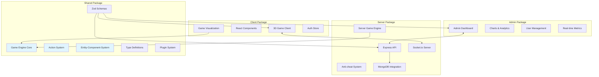

# GameBoilerplate Monorepo

> A comprehensive game development boilerplate featuring a modular ECS (Entity-Component-System) architecture, real-time multiplayer capabilities, and TypeScript-first development with shared state management across all packages.

---

## 🎯 What Makes This Special

This boilerplate provides everything you need to build modern multiplayer games:

- **🎮 Complete Game Engine**: ECS architecture with pluggable systems
- **🌐 Real-time Multiplayer**: WebSocket-based synchronization
- **📦 Shared State Management**: Centralized game logic across client/server/admin
- **🎨 3D Visualization**: React Three Fiber integration
- **🛡️ Type Safety**: End-to-end TypeScript with Zod validation
- **🔌 Plugin System**: Extensible game mechanics
- **📊 Admin Dashboard**: Real-time monitoring and management

---

## 🏗️ Architecture Overview



## 📋 Requirements

- **Node.js**: 22.x or higher (will work with 20.x with warnings)
- **NPM**: 10.x or higher
- **MongoDB**: 7.x or higher (for development)

### Quick Node.js Setup

If you don't have Node.js 22, you can use the provided setup scripts:

**Windows:**
```cmd
setup-node.bat
```

**macOS/Linux:**
```bash
chmod +x setup-node.sh
./setup-node.sh
```

Or manually with NVM:
```bash
nvm install 22
nvm use 22
```

---

## 📦 Package Architecture

| Package | Purpose | Key Features | Documentation |
|---------|---------|-------------|---------------|
| **[`shared`](./packages/shared)** | Core game engine & types | ECS, Actions, Plugins, Schemas | [📖 Shared Docs](./packages/shared/README.md) |
| **[`server`](./packages/server)** | Game server & API | Real-time sync, Auth, Anti-cheat | [📖 Server Docs](./packages/server/README.md) |
| **[`client`](./packages/client)** | 3D game interface | React Three Fiber, Real-time UI | [📖 Client Docs](./packages/client/README.md) |
| **[`admin`](./packages/admin)** | Management dashboard | Analytics, User management | [📖 Admin Docs](./packages/admin/README.md) |
| **[`tests`](./tests)** | Testing infrastructure | Visual regression, Unit tests | [📖 Test Docs](./tests/README.md) |

---

## 🔄 Game State Management

### State Flow Architecture


### Shared Components from `packages/shared`

The shared package provides the foundation for all game logic:

```typescript
// Example: Using shared game engine in server
import { GameEngine, ActionSystem } from '@gameboilerplate/shared';

const engine = new GameEngine();
await engine.init();

// Register game actions
engine.registerAction({
  type: 'movePlayer',
  schema: z.object({
    direction: z.enum(['north', 'south', 'east', 'west']),
    distance: z.number().min(1).max(10)
  }),
  cooldown: 1000,
  handler: async (data, context) => {
    // Game logic here
    return { success: true };
  }
});
```

```typescript
// Example: Using shared types in client
import type { GameAction, GameEvent } from '@gameboilerplate/shared';

const sendAction = (action: GameAction) => {
  socket.emit('gameAction', action);
};
```

---

## 🎮 Action Processing Flow

### How Game Actions Work


### Action Definition Example

```typescript
// Define a custom action in shared package
export const AttackActionSchema = z.object({
  targetId: z.string(),
  attackType: z.enum(['melee', 'ranged', 'magic']),
  power: z.number().min(1).max(100)
});

// Register in server
engine.registerAction({
  type: 'attack',
  schema: AttackActionSchema,
  cooldown: 2000, // 2 second cooldown
  handler: async (data, context) => {
    const attacker = context.engine.getEntity(context.userId);
    const target = context.engine.getEntity(data.targetId);
    
    if (!attacker || !target) {
      return { 
        success: false, 
        message: 'Invalid target' 
      };
    }
    
    // Calculate damage
    const damage = calculateDamage(attacker, data.attackType, data.power);
    target.properties.health -= damage;
    
    return {
      success: true,
      data: { damage, targetHealth: target.properties.health },
      events: [{
        type: 'combat:attack',
        data: { 
          attackerId: context.userId, 
          targetId: data.targetId, 
          damage 
        },
        timestamp: Date.now()
      }]
    };
  }
});
```

```typescript
// Use in client
const handleAttack = async (targetId: string) => {
  const action: GameAction = {
    type: 'attack',
    targetId,
    attackType: 'melee',
    power: 50
  };
  
  socket.emit('gameAction', action);
};
```

---

## 🚀 Quick Start

### 1. Installation & Setup
```sh
# Install all dependencies
npm install

# Build all packages
npm run build

# Run tests to verify setup
npm test
```

### 2. Start Development Environment
```sh
# Terminal 1: Start server
cd packages/server && npm run dev

# Terminal 2: Start client
cd packages/client && npm run dev

# Terminal 3: Start admin (optional)
cd packages/admin && npm run dev
```

### 3. Access Applications
- **Client Game**: [http://localhost:5173](http://localhost:5173)
- **Admin Dashboard**: [http://localhost:5174](http://localhost:5174) 
- **Server API**: [http://localhost:3000](http://localhost:3000)

## 🔧 Extending the Game Engine

### Creating Custom Game Systems

1. **Define Your System**
```typescript
import { System, GameState, IGameEngine } from '@gameboilerplate/shared';

class WeatherSystem implements System {
  name = 'WeatherSystem';
  priority = 15;
  enabled = true;
  
  private weatherState = {
    temperature: 20,
    humidity: 50,
    windSpeed: 5
  };

  async init(engine: IGameEngine): Promise<void> {
    console.log('🌤️ Weather system initialized');
  }

  async update(deltaTime: number, gameState: GameState): Promise<void> {
    // Update weather every 30 seconds
    if (gameState.totalTime % 30000 < deltaTime) {
      this.weatherState.temperature += (Math.random() - 0.5) * 2;
      
      // Affect entities based on weather
      for (const entity of gameState.entities.values()) {
        if (entity.type === 'player') {
          this.applyWeatherEffects(entity);
        }
      }
    }
  }

  private applyWeatherEffects(entity: GameEntity): void {
    if (this.weatherState.temperature < 0) {
      entity.properties.coldEffect = true;
    }
  }
}
```

2. **Register System in Server**
```typescript
// In server initialization
const weatherSystem = new WeatherSystem();
gameEngine.addSystem(weatherSystem);
```

### Creating Custom Actions

1. **Define Action Schema**
```typescript
// In shared package
export const CraftItemSchema = z.object({
  recipe: z.string(),
  materials: z.array(z.object({
    itemId: z.string(),
    quantity: z.number().min(1)
  })),
  craftingStationId: z.string().optional()
});
```

2. **Register Action Handler**
```typescript
engine.registerAction({
  type: 'craftItem',
  schema: CraftItemSchema,
  cooldown: 5000,
  handler: async (data, context) => {
    const player = context.engine.getEntity(context.userId);
    const recipe = getRecipe(data.recipe);
    
    // Check materials
    if (!hasRequiredMaterials(player, data.materials)) {
      return { 
        success: false, 
        message: 'Insufficient materials' 
      };
    }
    
    // Consume materials and create item
    consumeMaterials(player, data.materials);
    const newItem = createItem(recipe.output);
    addToInventory(player, newItem);
    
    return {
      success: true,
      data: { craftedItem: newItem },
      events: [{
        type: 'item:crafted',
        data: { 
          playerId: context.userId, 
          recipe: data.recipe,
          item: newItem
        },
        timestamp: Date.now()
      }]
    };
  }
});
```

### Creating Game Plugins

1. **Plugin Structure**
```typescript
import { GamePlugin, IGameEngine } from '@gameboilerplate/shared';

export class TradingPlugin implements GamePlugin {
  name = 'TradingPlugin';
  version = '1.0.0';
  dependencies = ['InventorySystem'];

  async install(engine: IGameEngine): Promise<void> {
    // Add trading system
    engine.addSystem(new TradingSystem());
    
    // Register trading actions
    this.registerTradingActions(engine);
    
    console.log('💼 Trading plugin installed');
  }

  async uninstall(engine: IGameEngine): Promise<void> {
    engine.removeSystem('TradingSystem');
    console.log('💼 Trading plugin uninstalled');
  }

  private registerTradingActions(engine: IGameEngine): void {
    engine.registerAction({
      type: 'createTrade',
      schema: z.object({
        offeredItems: z.array(ItemSchema),
        requestedItems: z.array(ItemSchema),
        targetPlayerId: z.string().optional()
      }),
      handler: this.handleCreateTrade.bind(this)
    });
  }

  private async handleCreateTrade(data: any, context: any) {
    // Trading logic implementation
    return { success: true };
  }
}
```

2. **Install Plugin**
```typescript
// In server
const tradingPlugin = new TradingPlugin();
await gameEngine.installPlugin(tradingPlugin);
```

### Game Type Presets

The engine comes with several preset configurations:

```typescript
// RPG Game - Character progression, inventory, quests
await engine.init('rpg');

// RTS Game - Units, resources, buildings
await engine.init('rts');

// MMO Game - Large-scale multiplayer systems
await engine.init('mmo');

// Custom Game - Start with minimal systems
await engine.init('custom');
```

---

## 🧪 Testing

### Running Tests
```sh
# Run all tests
npm test

# Run specific test suites
npm run test:unit          # Unit tests only
npm run test:admin         # Admin package tests
npm run test:unit:shared   # Shared package tests
```

### Test Structure
```
tests/
├── unit/                  # Unit tests for each package
│   ├── shared/           # Shared package tests
│   ├── server/           # Server tests
│   └── client/           # Client tests
├── integration/          # Cross-package integration tests
├── visual/              # Visual regression tests
└── e2e/                 # End-to-end tests
```

---

## 🛠️ Development Tools

### Available Scripts

| Command | Description |
|---------|-------------|
| `npm run build` | Build all packages |
| `npm run dev` | Start all dev servers |
| `npm run lint` | Lint all packages |
| `npm run format` | Format code with Prettier |
| `npm test` | Run all tests |
| `npm run dev:server` | Start server only |
| `npm run dev:client` | Start client only |
| `npm run dev:admin` | Start admin only |

### Debugging

The engine includes comprehensive debugging tools:

```typescript
// Enable debug mode
const engine = new GameEngine({
  enableDebug: true,
  enableProfiling: true
});

// Get engine statistics
const stats = engine.getStats();
console.log('FPS:', stats.fps);
console.log('Entities:', stats.entityCount);
console.log('Memory:', stats.memory);
```

---

## 📊 Tech Stack Details

### Frontend Packages
| Technology | Purpose | Version |
|------------|---------|---------|
| **React** | UI Framework | ^18.3.1 |
| **React Three Fiber** | 3D Rendering | ^9.3.0 |
| **Material-UI** | Admin Components | ^7.2.0 |
| **Zustand** | State Management | ^5.0.6 |
| **Vite** | Build Tool | ^7.0.6 |

### Backend & Shared
| Technology | Purpose | Version |
|------------|---------|---------|
| **Express.js** | Web Framework | ^4.21.2 |
| **Socket.io** | Real-time Communication | ^4.8.1 |
| **Mongoose** | MongoDB ODM | ^8.17.0 |
| **JWT** | Authentication | ^9.0.2 |
| **Zod** | Schema Validation | ^4.0.14 |

### Development & Testing
| Technology | Purpose | Version |
|------------|---------|---------|
| **TypeScript** | Type Safety | ^5.7.2 |
| **Turborepo** | Monorepo Management | ^2.3.3 |
| **Jest** | Unit Testing | ^30.0.5 |
| **Playwright** | E2E Testing | ^1.54.1 |
| **ESLint** | Code Linting | ^9.17.0 |
| **Prettier** | Code Formatting | ^3.4.2 |

---

## 🤝 Contributing

1. **Fork the repository**
2. **Create a feature branch**
   ```sh
   git checkout -b feature/awesome-feature
   ```
3. **Make your changes**
4. **Run tests and linting**
   ```sh
   npm run lint && npm test
   ```
5. **Commit your changes**
   ```sh
   git commit -m 'Add awesome feature'
   ```
6. **Push to your branch**
   ```sh
   git push origin feature/awesome-feature
   ```
7. **Open a Pull Request**

### Development Guidelines

- **Type Safety**: All code must be TypeScript with proper typing
- **Testing**: New features require corresponding tests
- **Documentation**: Update relevant README files
- **Linting**: Code must pass ESLint and Prettier checks
- **Shared Logic**: Common game logic belongs in the shared package

---

## 📝 License

This project is licensed under the MIT License - see the [LICENSE](LICENSE) file for details.

---

## 🎯 Roadmap

- [ ] **Enhanced Plugin System** - Hot-reloading plugins
- [ ] **Visual Editor** - Web-based game editor
- [ ] **Advanced Networking** - P2P capabilities
- [ ] **Mobile Support** - React Native integration
- [ ] **VR Support** - WebXR integration
- [ ] **Cloud Deployment** - Docker & Kubernetes configs

---

## 🆘 Support

- **Documentation**: Each package has detailed README files
- **Examples**: Check the `examples/` directory (coming soon)
- **Issues**: [GitHub Issues](https://github.com/NowakAydm/GameBoilerplate/issues)
- **Discussions**: [GitHub Discussions](https://github.com/NowakAydm/GameBoilerplate/discussions)

---

*Built with ❤️ for the game development community*
