# GameBoilerplate Monorepo

> A comprehensive game development boilerplate featuring a modular ECS (Entity-Component-System) architecture, real-time multiplayer capabilities, and TypeScript-first development with shared state management across all packages.

## 📚 Table of Contents

- [🎯 What Makes This Special](#-what-makes-this-special)
- [🏗️ Architecture Overview](#️-architecture-overview)
- [📋 Requirements](#-requirements)
- [📦 Package Architecture](#-package-architecture)
- [🚀 Quick Start](#-quick-start)
- [🌐 Deployment on Render.com](#-deployment-on-rendercom)
- [📊 Admin Dashboard & Real-time Analytics](#-admin-dashboard--real-time-analytics)
- [🔄 Game State Management](#-game-state-management)
  - [Game Data Management](#game-data-management)
- [🎮 Action Processing Flow](#-action-processing-flow)
- [🧪 Testing](#-testing)
- [🛠️ Development Tools](#️-development-tools)
- [📊 Tech Stack Details](#-tech-stack-details)
- [🤝 Contributing](#-contributing)
- [📝 License](#-license)
- [🎯 Roadmap](#-roadmap)
- [🆘 Support](#-support)

### 📖 Documentation Links

| Document | Description |
|----------|-------------|
| [📋 Phase 1 README](./docs/PHASE1_README.md) | Initial setup and basic architecture |
| [📋 Phase 2 README](./docs/PHASE2_README.md) | Server implementation and API |
| [📋 Phase 3 README](./docs/PHASE3_README.md) | Client development and 3D integration |
| [📋 Phase 4 README](./docs/PHASE4_README.md) | Admin dashboard and real-time analytics |
| [📋 Phase 5 README](./docs/PHASE5_README.md) | Advanced features and optimization |
| [🗺️ Project Roadmap](./docs/ROADMAP.md) | Detailed development roadmap |
| [📖 Context Documentation](./docs/CONTEXT.md) | Project context and background |
| [🔧 MongoDB Setup](./docs/MONGODB_SETUP.md) | Database configuration guide |
| [💾 Game Data Management](./docs/GAME_DATA.md) | User game data persistence features |

---

## 🎯 What Makes This Special

This boilerplate provides everything you need to build modern multiplayer games:

- **🎮 Complete Game Engine**: ECS architecture with pluggable systems
- **🌐 Real-time Multiplayer**: WebSocket-based synchronization
- **📦 Shared State Management**: Centralized game logic across client/server/admin
- **💾 Game Data Persistence**: Player inventory, stats, and position persistence between sessions
- **🎨 3D Visualization**: React Three Fiber integration
- **🛡️ Type Safety**: End-to-end TypeScript with Zod validation
- **🔌 Plugin System**: Extensible game mechanics
- **📊 Admin Dashboard**: Real-time monitoring and management with **live backend metrics**

---

## 🏗️ Architecture Overview

### High-Level System Architecture

```mermaid
flowchart TD
    subgraph "🎮 Client Package"
        C1["React Three Fiber<br/>3D Game Client"]
        C2["Real-time UI<br/>Components"]
        C3["Game State<br/>Visualization"]
    end
    
    subgraph "📊 Admin Package"  
        A1["Admin Dashboard<br/>Management UI"]
        A2["Live Analytics<br/>Charts"]
        A3["User Server<br/>Monitoring"]
    end
    
    subgraph "🖥️ Server Package"
        S1["Express REST API<br/>Authentication"]
        S2["Socket.io Server<br/>Real-time Sync"]
        S3["Metrics Service<br/>Analytics Engine"]
        S4["Anti-cheat<br/>Game Logic"]
        S5["UserService<br/>Game Data Management"]
    end
    
    subgraph "⚡ Shared Package"
        SH1["Game Engine Core<br/>ECS Architecture"]
        SH2["Action System<br/>Event Handling"]
        SH3["Type Schemas<br/>Validation"]
    end
    
    subgraph "💾 Data Layer"
        DB[(MongoDB<br/>Game Data)]
        CACHE[(Memory Cache<br/>Metrics)]
    end

    %% Client connections
    C1 <==> S2
    C2 <==> S1
    C3 --> SH1
    
    %% Admin connections  
    A1 <==> S1
    A1 <==> S5
    A2 <==> S3
    A3 <==> S3
    
    %% Server internal
    S1 --> S4
    S2 --> S4
    S3 --> CACHE
    S4 --> SH1
    
    %% Data persistence
    S1 --> DB
    S4 --> DB
    S5 --> DB
    
    %% Shared dependencies
    SH3 --> C1
    SH3 --> S1  
    SH3 --> A1
    SH2 --> S4
    
    %% Enhanced styling for better readability
    classDef clientStyle fill:#e8f4fd,stroke:#1976d2,stroke-width:3px,color:#000000,font-weight:bold
    classDef adminStyle fill:#f8f0ff,stroke:#7b1fa2,stroke-width:3px,color:#000000,font-weight:bold
    classDef serverStyle fill:#f0f8f0,stroke:#388e3c,stroke-width:3px,color:#000000,font-weight:bold
    classDef sharedStyle fill:#fff8e1,stroke:#f57c00,stroke-width:3px,color:#000000,font-weight:bold
    classDef dataStyle fill:#fdf2f8,stroke:#c2185b,stroke-width:3px,color:#000000,font-weight:bold
    
    class C1,C2,C3 clientStyle
    class A1,A2,A3 adminStyle
    class S1,S2,S3,S4,S5 serverStyle
    class SH1,SH2,SH3 sharedStyle
    class DB,CACHE dataStyle
```



### Package Responsibilities

| Package | Core Purpose | Key Components | Real-time Features |
|---------|-------------|----------------|-------------------|
| **🎮 Client** | Game interface & player interaction | React Three Fiber, Game UI, Auth | WebSocket sync, 3D visualization |
| **📊 Admin** | Server monitoring & management | Dashboard, Charts, User tools | Live metrics, real-time analytics |
| **🖥️ Server** | Game logic & API services | REST API, Socket.io, Metrics | Anti-cheat, live data tracking |
| **⚡ Shared** | Common game foundation | ECS, Actions, Types, Validation | Cross-package type safety |

## 📋 Requirements

- **Node.js**: 22.x or higher (will work with 20.x with warnings)
- **NPM**: 10.x or higher
- **MongoDB**: 7.x or higher (for development)

### Quick Node.js Setup

If you don't have Node.js 22, you can use the provided setup scripts:

**Windows:**
```cmd
setup-node.bat
```

**macOS/Linux:**
```bash
chmod +x setup-node.sh
./setup-node.sh
```

Or manually with NVM:
```bash
nvm install 22
nvm use 22
```

---

## 📦 Package Architecture

| Package | Purpose | Key Features | Documentation |
|---------|---------|-------------|---------------|
| **shared** | Core game engine & types | ECS, Actions, Plugins, Schemas | [📖 Shared Docs](./packages/shared/README.md) |
| **server** | Game server & API | Real-time sync, Auth, Anti-cheat, MetricsService | [📖 Server Docs](./packages/server/README.md) |
| **client** | 3D game interface | React Three Fiber, Real-time UI | [📖 Client Docs](./packages/client/README.md) |
| **admin** | Management dashboard | Real-time Analytics, User management, Live Charts | [📖 Admin Docs](./packages/admin/README.md) |
| **tests** | Testing infrastructure | Visual regression, Unit tests, Mock Server | [📖 Test Docs](./tests/README.md) |

---

## 📊 Admin Dashboard & Real-time Analytics

The admin package provides comprehensive server monitoring and management with **real-time data** from the backend MetricsService, not mock data.

### 🎯 Admin Features (Phase 4 Implementation)

| Feature | Description | Data Source | Update Frequency |
|---------|-------------|-------------|------------------|
| **📈 Live Dashboard** | Server stats, user counts, uptime | `/admin/stats` → MetricsService | Every 5 seconds |
| **📊 Analytics Charts** | Player trends, activity patterns | `/admin/metrics/charts` → Real-time data | Live updates |
| **👥 User Management** | Active sessions, playtime tracking | `/admin/users` → UserSession tracking | Every 10 seconds |
| **🎮 Game States** | Active players, positions, actions | `/admin/game-states` → AntiCheatService | Real-time |
| **� Game Data** | Player inventory, stats, position management | `/admin/game-data` → UserService | On-demand |
| **�📋 System Logs** | Server events, auth, errors | `/admin/logs` → System logging | Every 5 seconds |
| **⚡ Performance** | Response times, server metrics | `/admin/metrics/*` → Live monitoring | Continuous |

### 🔗 Available Admin API Endpoints

All admin endpoints require JWT authentication with admin role and provide **real backend data**:

```typescript
// Real-time server statistics
GET /admin/stats
// → Returns: activeConnections, totalUsers, gameMetrics, serverUptime

// Live user analytics with guest/registered breakdown  
GET /admin/metrics/user-types
// → Returns: registeredUsers, guestUsers, session data, playtimes

// Chart data for analytics dashboards
GET /admin/metrics/charts  
// → Returns: playerCountOverTime, gameActivityTimeline, actionDistribution

// Active user sessions and playtime
GET /admin/users
// → Returns: user sessions, playtime data, online status

// Current game states from AntiCheatService
GET /admin/game-states
// → Returns: player positions, health, experience, game actions

// System logs with filtering
GET /admin/logs?type=auth&level=error
// → Returns: categorized logs (socket, game, auth, system)

// Administrative actions
POST /admin/cleanup        // Cleanup inactive states
POST /admin/kick/:userId   // Kick specific user
```

### 📱 Mobile-Friendly Design

The admin dashboard is fully responsive and optimized for:
- **📱 Mobile devices**: Touch-friendly controls, collapsible sidebar
- **💻 Desktop**: Full-featured dashboard with multiple panels
- **📊 Chart scaling**: Responsive Chart.js visualizations
- **🔄 Auto-refresh**: Configurable update intervals for different data

### 🛠️ Backend Data Integration

The admin system uses **real backend services**, not mock data:

```typescript
// MetricsService tracks real user activity
metricsTracker.trackUserConnection(userId, socketId, username, email, role, isGuest);
metricsTracker.trackGameAction(userId, actionType);
metricsTracker.trackGameStateRequest(userId);

// Admin routes serve live data  
router.get('/admin/stats', async (req, res) => {
  const gameMetrics = metricsTracker.getGameMetrics(); // Real metrics
  const dbUsers = await UserModel.countDocuments();    // Live DB data
  // ... return combined real-time statistics
});
```

---

## 🔄 Game State Management

### State Flow Architecture


### Game Data Management

The `UserService` has been enhanced with game data persistence capabilities, allowing player data to be stored and retrieved between sessions:


#### UserService Game Data Methods

| Category | Methods | Description |
|----------|---------|-------------|
| **Basic** | `getUserGameData`, `updateUserGameData` | Core data retrieval and updates |
| **Position** | `updatePlayerPosition` | Update player world coordinates |
| **Stats** | `updatePlayerStats` | Manage level and experience |
| **Inventory** | `addToInventory`, `removeFromInventory` | Item management |
| **User Management** | `createGuestUser`, `upgradeGuestToRegistered` | User accounts with game data |

#### GameDataService Layer

A higher-level abstraction for common game operations:

```typescript
// Award experience and handle level-ups
const didLevelUp = await gameDataService.awardExperience(userId, 100);

// Manage player inventory
await gameDataService.giveItem(userId, {
  id: 'sword-123',
  name: 'Excalibur',
  type: 'weapon'
});

// Retrieve complete player data
const playerData = await gameDataService.getPlayerData(userId);
```

For complete documentation, see [Game Data Management](./docs/GAME_DATA.md).

### Shared Components from `packages/shared`

The shared package provides the foundation for all game logic:

```typescript
// Example: Using shared game engine in server
import { GameEngine, ActionSystem } from '@gameboilerplate/shared';

const engine = new GameEngine();
await engine.init();

// Register game actions
engine.registerAction({
  type: 'movePlayer',
  schema: z.object({
    direction: z.enum(['north', 'south', 'east', 'west']),
    distance: z.number().min(1).max(10)
  }),
  cooldown: 1000,
  handler: async (data, context) => {
    // Game logic here
    return { success: true };
  }
});
```

```typescript
// Example: Using shared types in client
import type { GameAction, GameEvent } from '@gameboilerplate/shared';

const sendAction = (action: GameAction) => {
  socket.emit('gameAction', action);
};
```

---

## 🎮 Action Processing Flow

### How Game Actions Work


### Action Definition Example

```typescript
// Define a custom action in shared package
export const AttackActionSchema = z.object({
  targetId: z.string(),
  attackType: z.enum(['melee', 'ranged', 'magic']),
  power: z.number().min(1).max(100)
});

// Register in server
engine.registerAction({
  type: 'attack',
  schema: AttackActionSchema,
  cooldown: 2000, // 2 second cooldown
  handler: async (data, context) => {
    const attacker = context.engine.getEntity(context.userId);
    const target = context.engine.getEntity(data.targetId);
    
    if (!attacker || !target) {
      return { 
        success: false, 
        message: 'Invalid target' 
      };
    }
    
    // Calculate damage
    const damage = calculateDamage(attacker, data.attackType, data.power);
    target.properties.health -= damage;
    
    return {
      success: true,
      data: { damage, targetHealth: target.properties.health },
      events: [{
        type: 'combat:attack',
        data: { 
          attackerId: context.userId, 
          targetId: data.targetId, 
          damage 
        },
        timestamp: Date.now()
      }]
    };
  }
});
```

```typescript
// Use in client
const handleAttack = async (targetId: string) => {
  const action: GameAction = {
    type: 'attack',
    targetId,
    attackType: 'melee',
    power: 50
  };
  
  socket.emit('gameAction', action);
};
```

---

## 🚀 Quick Start

### 1. Installation & Setup
```sh
# Install all dependencies
npm install

# Build all packages
npm run build

# Run tests to verify setup
npm test
```

### 2. Start Development Environment
```sh
# Terminal 1: Start server
cd packages/server && npm run dev

# Terminal 2: Start client
cd packages/client && npm run dev

# Terminal 3: Start admin (optional)
cd packages/admin && npm run dev
```

### 3. Access Applications
- **Client Game**: [http://localhost:5173](http://localhost:5173)
- **Admin Dashboard**: [http://localhost:5174](http://localhost:5174) *(responsive design, works on mobile)*
- **Server API**: [http://localhost:3000](http://localhost:3000)

---

## 🌐 Deployment on Render.com

Deploy your GameBoilerplate application to Render.com with these step-by-step instructions:

### Prerequisites

Before deploying, ensure you have:
- A [Render.com](https://render.com) account
- Your code pushed to a GitHub repository
- MongoDB Atlas or another external database setup
- Environment variables prepared

### 1. Prepare Your Repository

First, make sure your repository is properly configured:

```bash
# Build all packages to verify everything works
npm run build

# Run tests to ensure stability
npm test

# Commit and push your latest changes
git add .
git commit -m "Prepare for Render.com deployment"
git push origin main
```

### 2. Deploy the Server (API)

1. **Create Web Service for Server**:
   - Go to [Render Dashboard](https://dashboard.render.com)
   - Click "New +" → "Web Service"
   - Connect your GitHub repository
   - Choose your GameBoilerplate repository

2. **Configure Server Service**:
   ```yaml
   Name: gameboilerplate-server
   Runtime: Node
   Build Command: npm install && npm run build
   Start Command: cd packages/server && npm start
   ```

3. **Environment Variables**:
   ```env
   NODE_ENV=production
   PORT=3000
   MONGODB_URI=mongodb+srv://your-atlas-connection-string
   JWT_SECRET=your-super-secure-jwt-secret
   ADMIN_USERNAME=admin
   ADMIN_PASSWORD=secure-admin-password
   CORS_ORIGIN=https://your-client-domain.onrender.com
   ```

4. **Advanced Settings**:
   - **Auto-Deploy**: Enable for automatic deployments on git push
   - **Health Check Path**: `/health` (if you have a health endpoint)

### 3. Deploy the Client (Game Interface)

1. **Create Static Site for Client**:
   - Click "New +" → "Static Site"
   - Connect the same repository

2. **Configure Client Service**:
   ```yaml
   Name: gameboilerplate-client
   Build Command: npm install && npm run build:client
   Publish Directory: packages/client/dist
   ```

3. **Environment Variables**:
   ```env
   VITE_API_URL=https://your-server-domain.onrender.com
   VITE_SOCKET_URL=https://your-server-domain.onrender.com
   VITE_ENVIRONMENT=production
   ```

### 4. Deploy the Admin Dashboard

1. **Create Static Site for Admin**:
   - Click "New +" → "Static Site"
   - Connect the same repository

2. **Configure Admin Service**:
   ```yaml
   Name: gameboilerplate-admin
   Build Command: npm install && npm run build:admin
   Publish Directory: packages/admin/dist
   ```

3. **Environment Variables**:
   ```env
   VITE_API_URL=https://your-server-domain.onrender.com
   VITE_ENVIRONMENT=production
   ```

### 5. Database Setup (MongoDB Atlas)

Since Render.com doesn't provide MongoDB, use MongoDB Atlas:

1. **Create MongoDB Atlas Cluster**:
   - Go to [MongoDB Atlas](https://cloud.mongodb.com)
   - Create a free M0 cluster
   - Set up database user credentials
   - Whitelist `0.0.0.0/0` for Render.com access

2. **Get Connection String**:
   ```
   mongodb+srv://<username>:<password>@cluster0.xxxxx.mongodb.net/<database-name>?retryWrites=true&w=majority
   ```

### 6. Custom Build Scripts

Add these scripts to your root `package.json` for Render.com:

```json
{
  "scripts": {
    "build": "turbo run build",
    "build:client": "cd packages/client && npm run build",
    "build:admin": "cd packages/admin && npm run build",
    "build:server": "cd packages/server && npm run build",
    "start:server": "cd packages/server && npm start"
  }
}
```

### 7. Deployment Configuration Files

Create a `render.yaml` in your project root for Infrastructure as Code:

```yaml
services:
  - type: web
    name: gameboilerplate-server
    runtime: node
    plan: starter
    buildCommand: npm install && npm run build:server
    startCommand: npm run start:server
    healthCheckPath: /health
    envVars:
      - key: NODE_ENV
        value: production
      - key: MONGODB_URI
        fromDatabase:
          name: gameboilerplate-db
          property: connectionString
      - key: JWT_SECRET
        generateValue: true
      - key: PORT
        value: 3000

  - type: web
    name: gameboilerplate-client
    runtime: static
    buildCommand: npm install && npm run build:client
    staticPublishPath: ./packages/client/dist
    envVars:
      - key: VITE_API_URL
        value: https://gameboilerplate-server.onrender.com

  - type: web
    name: gameboilerplate-admin
    runtime: static
    buildCommand: npm install && npm run build:admin
    staticPublishPath: ./packages/admin/dist
    envVars:
      - key: VITE_API_URL
        value: https://gameboilerplate-server.onrender.com

databases:
  - name: gameboilerplate-db
    databaseName: gameboilerplate
    user: gameuser
```

### 8. Post-Deployment Verification

After deployment, verify everything works:

1. **Check Server Health**:
   ```bash
   curl https://your-server-domain.onrender.com/health
   ```

2. **Test API Endpoints**:
   ```bash
   curl https://your-server-domain.onrender.com/api/auth/guest
   ```

3. **Verify Client Connection**:
   - Visit your client URL
   - Check browser console for connection errors
   - Test authentication flow

4. **Test Admin Dashboard**:
   - Visit admin URL
   - Login with admin credentials
   - Verify real-time data is loading

### 9. Monitoring and Maintenance

1. **Set up Monitoring**:
   - Enable Render.com metrics and alerts
   - Monitor server logs in Render dashboard
   - Set up MongoDB Atlas monitoring

2. **Regular Maintenance**:
   ```bash
   # Check server logs
   render logs --service gameboilerplate-server

   # View deployment history
   render deploys --service gameboilerplate-server
   ```

### 💡 Deployment Tips

- **Cold Starts**: Free tier services sleep after 15 minutes of inactivity
- **Custom Domains**: Upgrade to paid plan for custom domains
- **SSL**: Automatic HTTPS on all Render.com services
- **Auto-Deploy**: Push to main branch triggers deployment
- **Environment Separation**: Use different branches for staging/production

### 🚨 Troubleshooting Deployment

**Common Issues and Solutions**:

1. **Build Failures**:
   ```bash
   # Check build logs in Render dashboard
   # Ensure all dependencies are in package.json
   # Verify build commands work locally
   ```

2. **Connection Issues**:
   ```env
   # Verify CORS_ORIGIN includes your client domain
   CORS_ORIGIN=https://your-client-domain.onrender.com
   ```

3. **Database Connection**:
   ```env
   # Check MongoDB Atlas IP whitelist
   # Verify connection string format
   # Test connection locally first
   ```

4. **WebSocket Issues**:
   ```javascript
   // Use HTTPS/WSS in production
   const socket = io(process.env.VITE_SOCKET_URL, {
     transports: ['websocket', 'polling']
   });
   ```

---

## 🔧 Extending the Game Engine

### Creating Custom Game Systems

1. **Define Your System**
```typescript
import { System, GameState, IGameEngine } from '@gameboilerplate/shared';

class WeatherSystem implements System {
  name = 'WeatherSystem';
  priority = 15;
  enabled = true;
  
  private weatherState = {
    temperature: 20,
    humidity: 50,
    windSpeed: 5
  };

  async init(engine: IGameEngine): Promise<void> {
    console.log('🌤️ Weather system initialized');
  }

  async update(deltaTime: number, gameState: GameState): Promise<void> {
    // Update weather every 30 seconds
    if (gameState.totalTime % 30000 < deltaTime) {
      this.weatherState.temperature += (Math.random() - 0.5) * 2;
      
      // Affect entities based on weather
      for (const entity of gameState.entities.values()) {
        if (entity.type === 'player') {
          this.applyWeatherEffects(entity);
        }
      }
    }
  }

  private applyWeatherEffects(entity: GameEntity): void {
    if (this.weatherState.temperature < 0) {
      entity.properties.coldEffect = true;
    }
  }
}
```

2. **Register System in Server**
```typescript
// In server initialization
const weatherSystem = new WeatherSystem();
gameEngine.addSystem(weatherSystem);
```

### Creating Custom Actions

1. **Define Action Schema**
```typescript
// In shared package
export const CraftItemSchema = z.object({
  recipe: z.string(),
  materials: z.array(z.object({
    itemId: z.string(),
    quantity: z.number().min(1)
  })),
  craftingStationId: z.string().optional()
});
```

2. **Register Action Handler**
```typescript
engine.registerAction({
  type: 'craftItem',
  schema: CraftItemSchema,
  cooldown: 5000,
  handler: async (data, context) => {
    const player = context.engine.getEntity(context.userId);
    const recipe = getRecipe(data.recipe);
    
    // Check materials
    if (!hasRequiredMaterials(player, data.materials)) {
      return { 
        success: false, 
        message: 'Insufficient materials' 
      };
    }
    
    // Consume materials and create item
    consumeMaterials(player, data.materials);
    const newItem = createItem(recipe.output);
    addToInventory(player, newItem);
    
    return {
      success: true,
      data: { craftedItem: newItem },
      events: [{
        type: 'item:crafted',
        data: { 
          playerId: context.userId, 
          recipe: data.recipe,
          item: newItem
        },
        timestamp: Date.now()
      }]
    };
  }
});
```

### Creating Game Plugins

1. **Plugin Structure**
```typescript
import { GamePlugin, IGameEngine } from '@gameboilerplate/shared';

export class TradingPlugin implements GamePlugin {
  name = 'TradingPlugin';
  version = '1.0.0';
  dependencies = ['InventorySystem'];

  async install(engine: IGameEngine): Promise<void> {
    // Add trading system
    engine.addSystem(new TradingSystem());
    
    // Register trading actions
    this.registerTradingActions(engine);
    
    console.log('💼 Trading plugin installed');
  }

  async uninstall(engine: IGameEngine): Promise<void> {
    engine.removeSystem('TradingSystem');
    console.log('💼 Trading plugin uninstalled');
  }

  private registerTradingActions(engine: IGameEngine): void {
    engine.registerAction({
      type: 'createTrade',
      schema: z.object({
        offeredItems: z.array(ItemSchema),
        requestedItems: z.array(ItemSchema),
        targetPlayerId: z.string().optional()
      }),
      handler: this.handleCreateTrade.bind(this)
    });
  }

  private async handleCreateTrade(data: any, context: any) {
    // Trading logic implementation
    return { success: true };
  }
}
```

2. **Install Plugin**
```typescript
// In server
const tradingPlugin = new TradingPlugin();
await gameEngine.installPlugin(tradingPlugin);
```

### Game Type Presets

The engine comes with several preset configurations:

```typescript
// RPG Game - Character progression, inventory, quests
await engine.init('rpg');

// RTS Game - Units, resources, buildings
await engine.init('rts');

// MMO Game - Large-scale multiplayer systems
await engine.init('mmo');

// Custom Game - Start with minimal systems
await engine.init('custom');
```

---

## 🤝 Contributing: Adding New Metrics & Features

### 📊 Adding New Metrics (Complete Guide)

Follow this end-to-end process to add new metrics to both backend and frontend:

#### 1. Backend: MetricsService Enhancement

```typescript
// Step 1: Add to MetricsService.ts interface
export interface GameMetrics {
  // ... existing metrics
  newCustomMetric: number;        // Add your metric
  newCustomMetricHistory: number; // If time-based
}

// Step 2: Update tracking in MetricsService
class MetricsTracker {
  private customMetricHistory: ChartDataPoint[] = [];

  public trackCustomMetric(userId: string, value: number) {
    // Your tracking logic
    this.customMetricHistory.push({
      timestamp: new Date(),
      value,
      label: `custom-${userId}`,
    });
  }

  public getGameMetrics(): GameMetrics {
    return {
      // ... existing metrics
      newCustomMetric: this.calculateCustomMetric(),
      newCustomMetricHistory: this.customMetricHistory.length,
    };
  }
}
```

#### 2. Server: Add API Endpoint

```typescript
// Step 3: Add route in admin.ts
router.get('/metrics/custom', (req: Request, res: Response) => {
  try {
    const customData = metricsTracker.getCustomMetricData();
    res.json({
      success: true,
      customMetric: customData,
      timestamp: new Date().toISOString(),
    });
  } catch (error) {
    res.status(500).json({ success: false, error: 'Failed to fetch custom metric' });
  }
});
```

#### 3. Frontend: Admin Dashboard Integration

```typescript
// Step 4: Update admin dashboard component
const CustomMetricChart = () => {
  const [metricData, setMetricData] = useState(null);

  useEffect(() => {
    const fetchMetrics = async () => {
      const response = await fetch('/admin/metrics/custom');
      const data = await response.json();
      setMetricData(data.customMetric);
    };

    fetchMetrics();
    const interval = setInterval(fetchMetrics, 30000); // Auto-refresh
    return () => clearInterval(interval);
  }, []);

  return (
    <Chart
      type="line"
      data={{
        labels: metricData?.timestamps || [],
        datasets: [{
          label: 'Custom Metric',
          data: metricData?.values || [],
        }]
      }}
    />
  );
};
```

#### 4. Testing Your New Metric

```typescript
// Step 5: Add tests in admin test suite
describe('Custom Metric', () => {
  test('should track custom metric correctly', async () => {
    metricsTracker.trackCustomMetric('user123', 42);
    const metrics = metricsTracker.getGameMetrics();
    expect(metrics.newCustomMetric).toBeGreaterThan(0);
  });

  test('should serve custom metric via API', async () => {
    const response = await request(app)
      .get('/admin/metrics/custom')
      .set('Authorization', `Bearer ${adminToken}`);
    expect(response.status).toBe(200);
    expect(response.body.success).toBe(true);
  });
});
```

### ✅ New Feature Checklist

When adding any new admin feature or metric:

- [ ] **Backend**: Update MetricsService with tracking logic
- [ ] **API**: Add admin route with proper authentication 
- [ ] **Frontend**: Create responsive admin component
- [ ] **Charts**: Ensure Chart.js compatibility and real data
- [ ] **Mobile**: Test responsive design on mobile devices
- [ ] **Tests**: Add unit tests for backend logic and API endpoints
- [ ] **Documentation**: Update API endpoint table in README
- [ ] **Type Safety**: Add TypeScript interfaces and Zod schemas
- [ ] **Real Data**: Verify charts use live backend data, not mocks
- [ ] **Performance**: Consider data retention and cleanup strategies

### 🔧 Common Integration Patterns

```typescript
// Pattern 1: Real-time metric with WebSocket updates
io.on('connection', (socket) => {
  socket.on('gameAction', (data) => {
    metricsTracker.trackGameAction(userId, data.type);
    // Metric automatically flows to admin dashboard
  });
});

// Pattern 2: Scheduled metric collection
setInterval(() => {
  const serverLoad = process.cpuUsage();
  metricsTracker.trackServerMetric('cpu_usage', serverLoad.user);
}, 60000);

// Pattern 3: Database-derived metrics
router.get('/admin/derived-metrics', async (req, res) => {
  const userGrowth = await UserModel.aggregate([
    { $group: { _id: { $dateToString: { format: "%Y-%m-%d", date: "$createdAt" } }, count: { $sum: 1 } } }
  ]);
  res.json({ userGrowth });
});
```

---

## 🧪 Testing

### Running Tests
```sh
# Run all tests
npm test

# Run specific test suites
npm run test:unit          # Unit tests only
npm run test:admin         # Admin package tests
npm run test:unit:shared   # Shared package tests
```

### Test Structure
```
tests/
├── unit/                  # Unit tests for each package
│   ├── shared/           # Shared package tests
│   ├── server/           # Server tests
│   └── client/           # Client tests
├── integration/          # Cross-package integration tests
├── visual/              # Visual regression tests
└── e2e/                 # End-to-end tests
```

---

## 🛠️ Development Tools

### Available Scripts

| Command | Description |
|---------|-------------|
| `npm run build` | Build all packages |
| `npm run dev` | Start all dev servers |
| `npm run lint` | Lint all packages |
| `npm run format` | Format code with Prettier |
| `npm test` | Run all tests |
| `npm run dev:server` | Start server only |
| `npm run dev:client` | Start client only |
| `npm run dev:admin` | Start admin only |

### Debugging

The engine includes comprehensive debugging tools:

```typescript
// Enable debug mode
const engine = new GameEngine({
  enableDebug: true,
  enableProfiling: true
});

// Get engine statistics
const stats = engine.getStats();
console.log('FPS:', stats.fps);
console.log('Entities:', stats.entityCount);
console.log('Memory:', stats.memory);
```

---

## 📊 Tech Stack Details

### Frontend Packages
| Technology | Purpose | Version |
|------------|---------|---------|
| **React** | UI Framework | ^18.3.1 |
| **React Three Fiber** | 3D Rendering | ^9.3.0 |
| **Material-UI** | Admin Components | ^7.2.0 |
| **Zustand** | State Management | ^5.0.6 |
| **Vite** | Build Tool | ^7.0.6 |

### Backend & Shared
| Technology | Purpose | Version |
|------------|---------|---------|
| **Express.js** | Web Framework | ^4.21.2 |
| **Socket.io** | Real-time Communication | ^4.8.1 |
| **Mongoose** | MongoDB ODM | ^8.17.0 |
| **JWT** | Authentication | ^9.0.2 |
| **Zod** | Schema Validation | ^4.0.14 |

### Development & Testing
| Technology | Purpose | Version |
|------------|---------|---------|
| **TypeScript** | Type Safety | ^5.7.2 |
| **Turborepo** | Monorepo Management | ^2.3.3 |
| **Jest** | Unit Testing | ^30.0.5 |
| **Playwright** | E2E Testing | ^1.54.1 |
| **ESLint** | Code Linting | ^9.17.0 |
| **Prettier** | Code Formatting | ^3.4.2 |

---

## 🤝 Contributing

1. **Fork the repository**
2. **Create a feature branch**
   ```sh
   git checkout -b feature/awesome-feature
   ```
3. **Make your changes**
4. **Run tests and linting**
   ```sh
   npm run lint && npm test
   ```
5. **Commit your changes**
   ```sh
   git commit -m 'Add awesome feature'
   ```
6. **Push to your branch**
   ```sh
   git push origin feature/awesome-feature
   ```
7. **Open a Pull Request**

### Development Guidelines

- **Type Safety**: All code must be TypeScript with proper typing
- **Testing**: New features require corresponding tests
- **Documentation**: Update relevant README files
- **Linting**: Code must pass ESLint and Prettier checks
- **Shared Logic**: Common game logic belongs in the shared package

---

## 📝 License

This project is licensed under the MIT License - see the [LICENSE](LICENSE) file for details.

---


## 🎯 Roadmap

- [x] **Hybrid Backend Approach**  
  Launch the first game with a unified backend, but abstract user management and game logic for future separation.
- [ ] **User Service Abstraction**  
  Implement a user service layer in the server package to handle all authentication, registration, and user profile logic. All user-related operations should go through this service.
- [ ] **Decouple Game Logic from User Logic**  
  Ensure game logic references users only via the user service, not directly via database models. Keep game state and user state separate in code.
- [ ] **API Boundary Planning**  
  Clearly document and implement API route boundaries (e.g., `/api/auth/*`, `/api/user/*`, `/api/game/*`) to prepare for future backend split.
- [ ] **First Game Launch**  
  Focus on shipping the first game using the current monorepo and unified backend.
- [ ] **Backend Split (Post-Launch)**  
  After the first game is live, migrate the user service to a dedicated backend and update game servers to communicate with it via API.
- [ ] **Enhanced Plugin System** - Hot-reloading plugins
- [ ] **Visual Editor** - Web-based game editor
- [ ] **Advanced Networking** - P2P capabilities
- [ ] **Mobile Support** - React Native integration
- [ ] **VR Support** - WebXR integration
- [ ] **Cloud Deployment** - Docker & Kubernetes configs

---

## 🆘 Support

- **Documentation**: Each package has detailed README files
- **Examples**: Check the `examples/` directory (coming soon)
- **Issues**: [GitHub Issues](https://github.com/NowakAydm/GameBoilerplate/issues)
- **Discussions**: [GitHub Discussions](https://github.com/NowakAydm/GameBoilerplate/discussions)

---

*Built with ❤️ for the game development community*
