# Game Engine Architecture

This document outlines the architecture of the GameBoilerplate engine, its core systems, and planned usage patterns.

## Overview

The GameBoilerplate engine is a modular, event-driven game engine designed for multiplayer games with real-time state management. It follows an Entity-Component-System (ECS) architecture with plugin support.

## Core Architecture

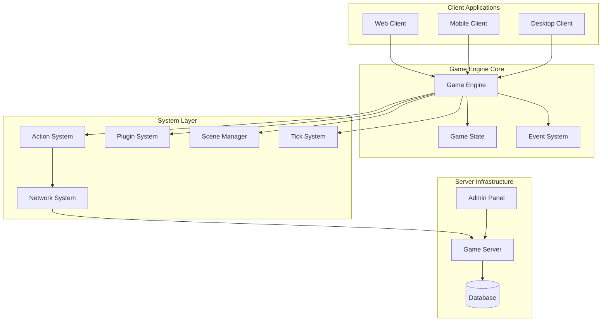

## Engine Core Components

### GameEngine
The central orchestrator that manages all systems, entities, and game state.

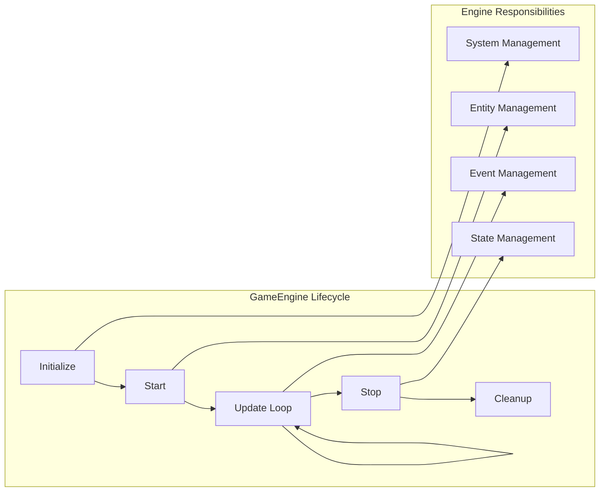

### Game State
Centralized state container that holds all game data.

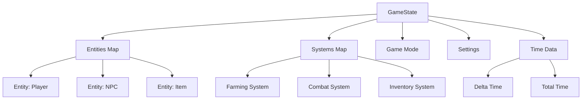

## System Architecture

### Action System
Handles player actions with validation, processing, and state changes.

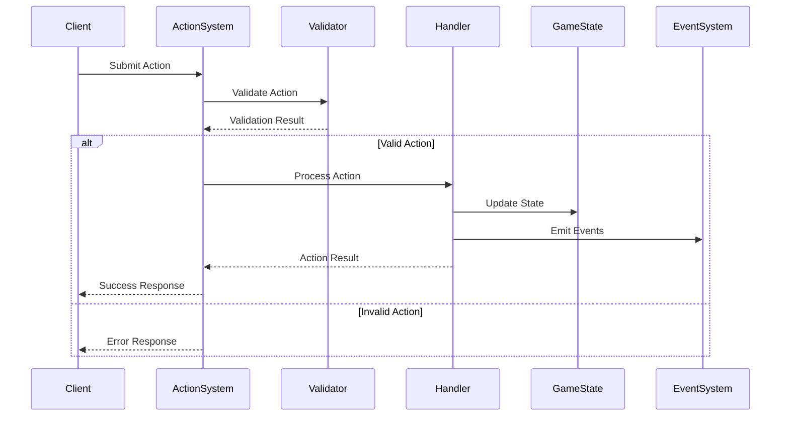

### Plugin System
Enables modular functionality through plugins.

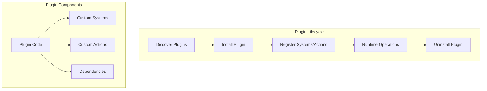

## Entity-Component-System Pattern

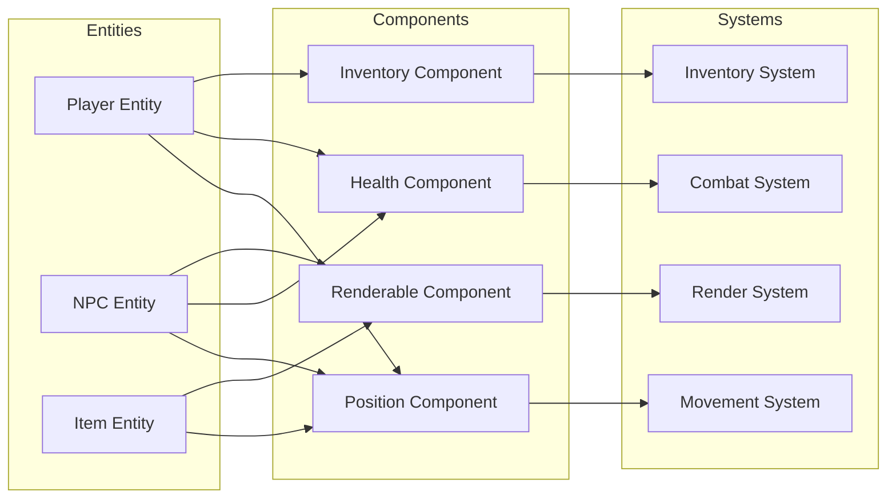

## Network Architecture

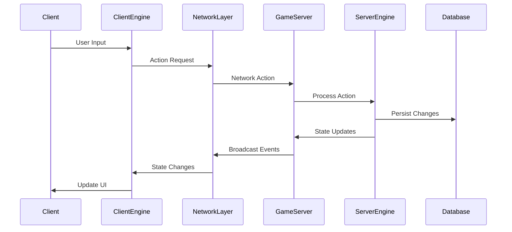

## Plugin Development Flow

```mermaid
graph TD
    Start[Start Plugin Development]
    Define[Define Plugin Interface]
    Implement[Implement Plugin Class]
    Systems[Create Custom Systems]
    Actions[Register Actions]
    Test[Test Plugin]
    Package[Package Plugin]
    Deploy[Deploy to Engine]
    
    Start --> Define
    Define --> Implement
    Implement --> Systems
    Implement --> Actions
    Systems --> Test
    Actions --> Test
    Test --> Package
    Package --> Deploy
    
    subgraph "Plugin Structure"
        Interface[GamePlugin Interface]
        Install[install() method]
        Uninstall[uninstall() method]
        Systems2[Custom Systems]
        Actions2[Action Definitions]
    end
    
    Define --> Interface
    Implement --> Install
    Implement --> Uninstall
    Systems --> Systems2
    Actions --> Actions2
```

## Planned Usage Patterns

### 1. Game Development Workflow

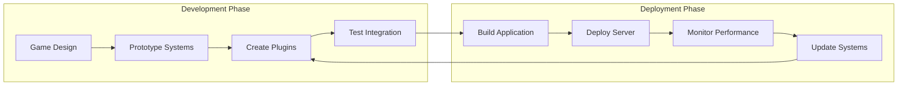

### 2. Runtime Game Loop

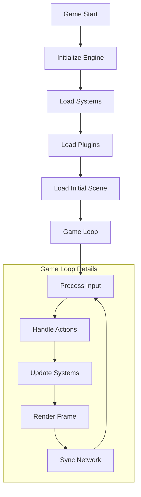

### 3. Multiplayer State Synchronization

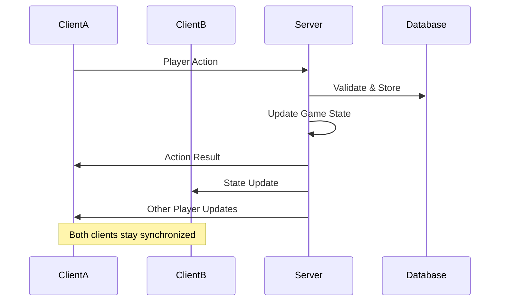

## Key Features

### Modular Design
- **Plugin System**: Add/remove functionality dynamically
- **System Architecture**: Loosely coupled systems
- **Event-Driven**: Reactive programming model

### Performance Optimization
- **Tick System**: Configurable update rates
- **Entity Pooling**: Efficient memory management
- **Priority Queues**: System execution order control

### Developer Experience
- **TypeScript**: Full type safety
- **Hot Reloading**: Development productivity
- **Debug Tools**: Runtime introspection
- **Testing Framework**: Comprehensive test coverage

### Scalability
- **Horizontal Scaling**: Multiple server instances
- **State Persistence**: Database integration
- **Load Balancing**: Distribute player load

## Future Enhancements

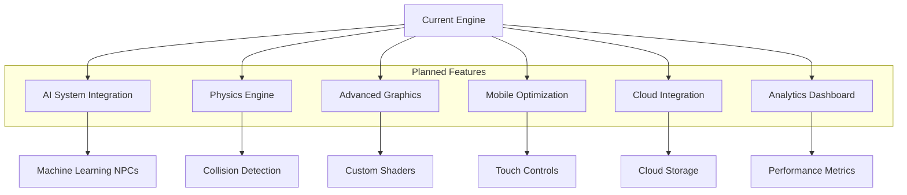

## Getting Started

1. **Basic Setup**: Initialize GameEngine with configuration
2. **Add Systems**: Register core systems (Action, Scene, Network)
3. **Load Plugins**: Install game-specific plugins
4. **Create Entities**: Add game objects to the world
5. **Start Engine**: Begin the game loop

```typescript
const engine = new GameEngine({
  tickRate: 60,
  maxEntities: 1000,
  enableDebug: true
});

await engine.init();
await engine.start();
```

This architecture provides a solid foundation for building scalable, maintainable multiplayer games while maintaining flexibility for various game genres and requirements.
