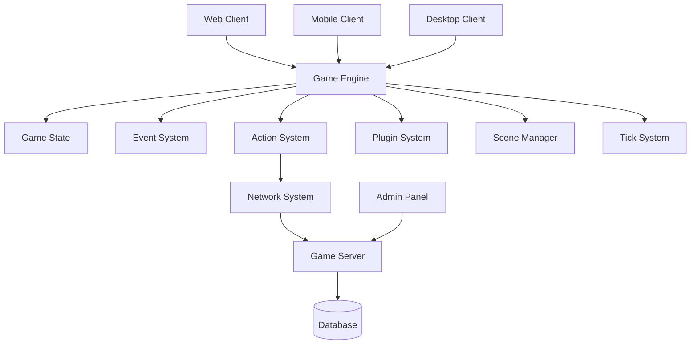
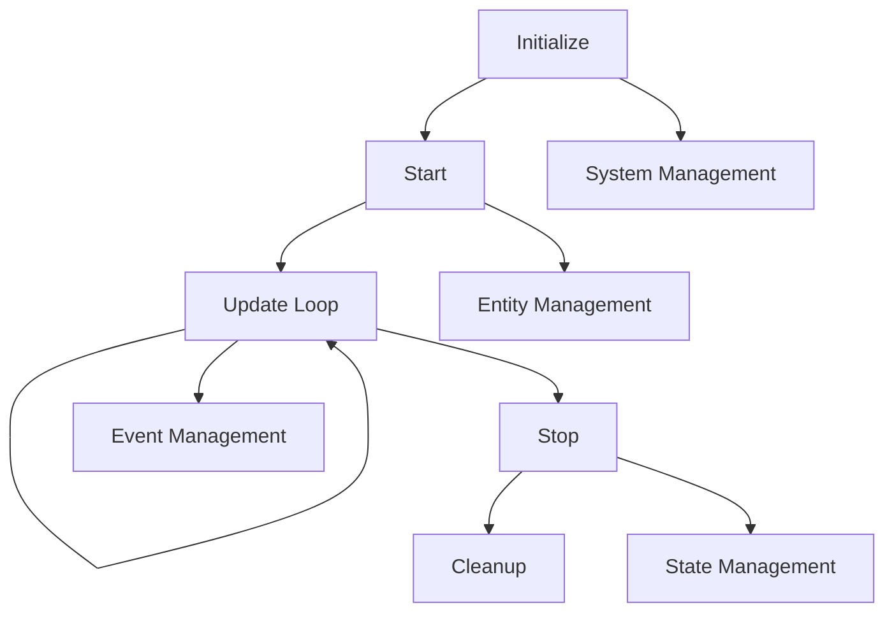
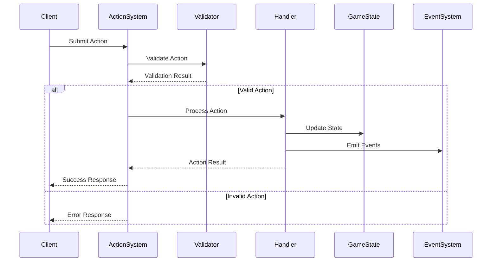
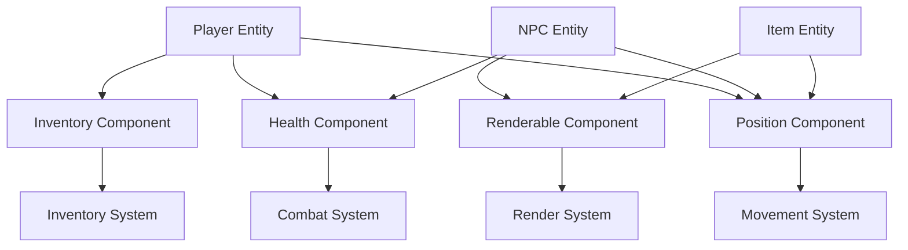
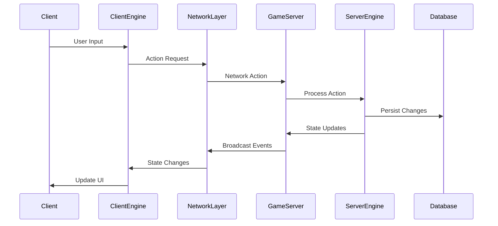
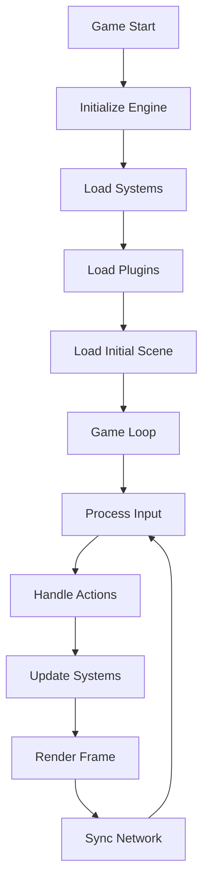
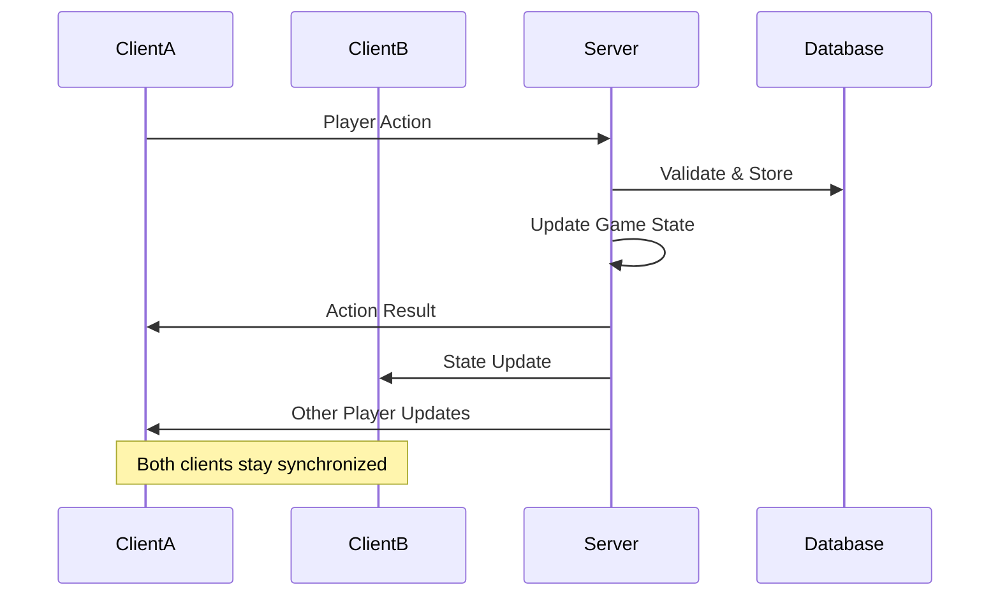

# Game Engine Architecture

This document outlines the architecture of the GameBoilerplate engine, its core systems, and planned usage patterns.

## Overview

The GameBoilerplate engine is a modular, event-driven game engine designed for multiplayer games with real-time state management. It follows an Entity-Component-System (ECS) architecture with plugin support.

## Core Architecture


## Engine Core Components

### GameEngine
The central orchestrator that manages all systems, entities, and game state.



### Game State
Centralized state container that holds all game data.

- **Entities Map**: [
    'Player',
    'NPC',
    'Item',
    // ...other entity types
  ]
- **Systems Map**: [
    'Farming System',
    'Combat System',
    'Inventory System',
    // ...other systems
  ]
- **Game Mode**: Current game mode or ruleset
- **Settings**: Game configuration and settings
- **Time Data**: {
    deltaTime: <number>,
    totalTime: <number>
  }

Entities are categorized (players, NPCs, items), and systems manage different aspects of gameplay. Time data tracks the progression of the game.

## System Architecture

### Action System
Handles player actions with validation, processing, and state changes.



### Plugin System
The plugin system enables modular functionality:

- **Lifecycle**:
  1. Discover plugins
  2. Install plugin
  3. Register systems/actions
  4. Runtime operations
  5. Uninstall plugin

- **Components**:
  - Plugin Code
  - Custom Systems
  - Custom Actions
  - Dependencies

This allows developers to extend or modify engine functionality without changing the core codebase.

## Entity-Component-System Pattern


## Network Architecture



## Plugin Development Flow
The typical plugin development flow is as follows:

1. **Start Plugin Development**
2. **Define Plugin Interface** (e.g., `GamePlugin` interface)
3. **Implement Plugin Class**
    - `install()` method
    - `uninstall()` method
4. **Create Custom Systems**
5. **Register Actions**
6. **Test Plugin**
7. **Package Plugin**
8. **Deploy to Engine**

Plugin Structure Example:
```typescript
interface GamePlugin {
  install(engine: GameEngine): void;
  uninstall(engine: GameEngine): void;
  systems?: CustomSystem[];
  actions?: ActionDefinition[];
}
```

## Planned Usage Patterns

### 1. Game Development Workflow
The game development workflow typically follows these phases:

**Development Phase:**
- Game Design
- Prototype Systems
- Create Plugins
- Test Integration

**Deployment Phase:**
- Build Application
- Deploy Server
- Monitor Performance
- Update Systems

The process is iterative, with updates leading back to plugin creation and further testing.

### 2. Runtime Game Loop


### 3. Multiplayer State Synchronization



## Key Features

### Modular Design
- **Plugin System**: Add/remove functionality dynamically
- **System Architecture**: Loosely coupled systems
- **Event-Driven**: Reactive programming model

### Performance Optimization
- **Tick System**: Configurable update rates
- **Entity Pooling**: Efficient memory management
- **Priority Queues**: System execution order control

### Developer Experience
- **TypeScript**: Full type safety
- **Hot Reloading**: Development productivity
- **Debug Tools**: Runtime introspection
- **Testing Framework**: Comprehensive test coverage

### Scalability
- **Horizontal Scaling**: Multiple server instances
- **State Persistence**: Database integration
- **Load Balancing**: Distribute player load

## Future Enhancements
Planned future enhancements for the engine include:

- **AI System Integration**
  - Machine Learning NPCs
- **Physics Engine**
  - Collision Detection
- **Advanced Graphics**
  - Custom Shaders
- **Mobile Optimization**
  - Touch Controls
- **Cloud Integration**
  - Cloud Storage
- **Analytics Dashboard**
  - Performance Metrics

These features will build on the current engine to expand capabilities and performance.

## Getting Started

1. **Basic Setup**: Initialize GameEngine with configuration
2. **Add Systems**: Register core systems (Action, Scene, Network)
3. **Load Plugins**: Install game-specific plugins
4. **Create Entities**: Add game objects to the world
5. **Start Engine**: Begin the game loop

```typescript
const engine = new GameEngine({
  tickRate: 60,
  maxEntities: 1000,
  enableDebug: true
});

await engine.init();
await engine.start();
```

This architecture provides a solid foundation for building scalable, maintainable multiplayer games while maintaining flexibility for various game genres and requirements.
