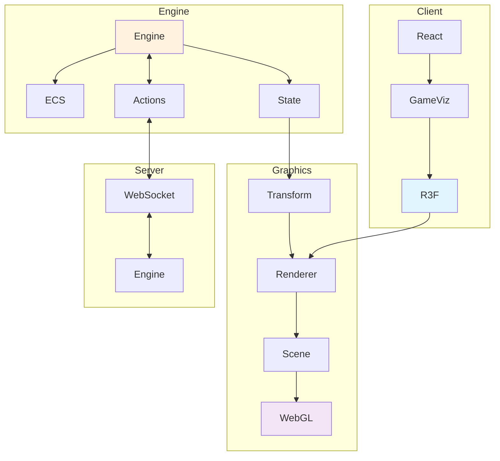
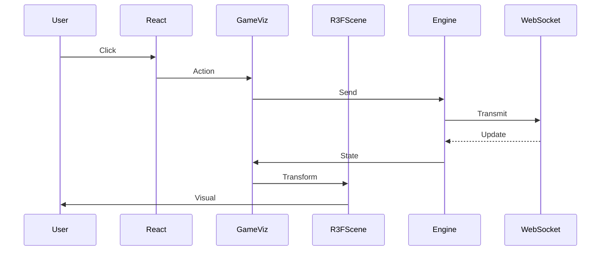
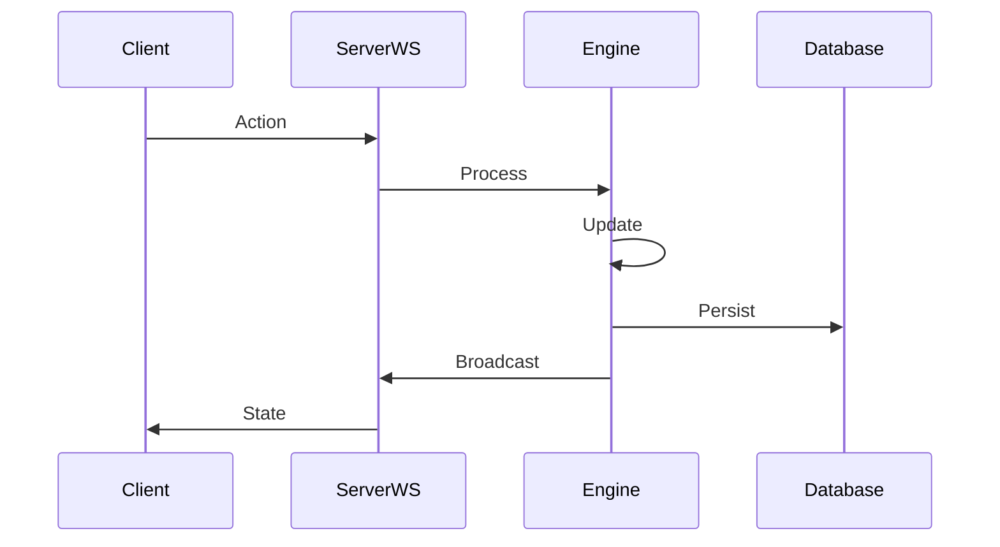

# Graphics Engine Integration Guide

This document explains how the GameBoilerplate project interfaces graphics rendering (React Three Fiber) with the core game engine, providing a comprehensive overview of the architecture and usage patterns.

## Overview

The GameBoilerplate project uses **React Three Fiber (R3F)** as the primary graphics engine, creating a seamless bridge between the ECS-based game engine and 3D visualization. This integration supports both 2D and 3D rendering modes while maintaining consistent performance and developer experience.

## Architecture Overview



## Core Components

### 1. Game Engine Integration Points

#### Game State to Graphics Bridge
The game engine maintains state using an Entity-Component-System (ECS) architecture, while R3F requires React-compatible entity representations.

**Key Files:**
- `packages/shared/src/engine/GameEngine.ts` - Core game engine
- `packages/client/src/components/shared/gameUtils.ts` - State transformation utilities
- `packages/client/src/components/shared/R3FRenderer.tsx` - R3F rendering components

#### Entity Transformation Pipeline

```typescript
// From GameEngine entities to R3F entities
interface GameEntity {
  id: string;
  position: Vector3;
  rotation: Vector3;
  scale: Vector3;
  type: string;
  components: Map<string, Component>;
}

// Transformed to SimpleEntity for R3F
interface SimpleEntity {
  id: string;
  position: { x: number; y: number; z: number };
  scale: { x: number; y: number; z: number };
  type: string;
  color?: string;
}
```

### 2. Rendering Architecture

#### Unified R3F System
Both 2D and 3D modes use the same React Three Fiber pipeline for consistency:

**2D Mode:**
- Orthographic camera with top-down view
- Limited orbit controls (no rotation)
- Z-axis used for layering

**3D Mode:**
- Perspective camera with full 3D freedom
- Complete orbit controls
- Full 3D spatial positioning

#### R3F Scene Structure

```tsx
// Main scene component structure
<Canvas>
  <GameCamera mode={mode} />           // Dynamic camera system
  <ambientLight intensity={0.4} />     // Scene lighting
  <directionalLight />
  <GroundPlane />                      // Environment
  
  {entities.map(entity => (
    <EntityRenderer                    // Dynamic entity rendering
      key={entity.id} 
      entity={entity} 
    />
  ))}
  
  <OrbitControls enableRotate={mode === '3d'} />
</Canvas>
```

## Data Flow Architecture

### 1. Client-Side Flow



### 2. Server-Side Integration



## Key Integration Files

### Core Engine Files

| File | Purpose | Role in Graphics Integration |
|------|---------|------------------------------|
| `packages/shared/src/engine/GameEngine.ts` | Main game engine class | Provides the core ECS system that drives graphics |
| `packages/shared/src/engine/types.ts` | Engine type definitions | Defines `GameEntity`, `Vector3`, and core interfaces |
| `packages/shared/src/engine/ActionSystem.ts` | Handles game actions | Processes user input that affects visual changes |

### Graphics Integration Files

| File | Purpose | Graphics Responsibility |
|------|---------|------------------------|
| `packages/client/src/components/shared/R3FRenderer.tsx` | Main R3F components | Renders game entities in 3D space |
| `packages/client/src/components/shared/gameUtils.ts` | Data transformation | Converts game state to R3F-compatible format |
| `packages/client/src/components/shared/GameCamera.tsx` | Camera management | Handles 2D/3D camera switching |
| `packages/client/src/components/GameVisualization.tsx` | High-level game UI | Orchestrates the complete game visualization |

### Game Engine R3F Components

| File | Purpose | Engine Integration |
|------|---------|-------------------|
| `packages/client/src/components/GameEngine.tsx` | Direct engine integration | Provides React hooks for engine interaction |
| `packages/client/src/components/GameScene.tsx` | Advanced 3D scene | More complex R3F scenes with engine entities |

## Usage Patterns

### 1. Basic Game Visualization Setup

```tsx
import { GameVisualization } from './components/GameVisualization';
import { useGameEngine } from './hooks/useGameEngine';

function GameApp() {
  const { gameState, sendGameAction, user, connectionStatus } = useGameEngine();

  return (
    <GameVisualization
      gameState={gameState}
      sendGameAction={sendGameAction}
      user={user}
      connectionStatus={connectionStatus}
      isAuthenticated={!!user}
    />
  );
}
```

### 2. Direct Engine Integration with R3F

```tsx
import { useGameEngine, GameScene } from '@gameboilerplate/shared';
import { Canvas } from '@react-three/fiber';

function AdvancedGameView() {
  const { engine, isLoading } = useGameEngine({
    gameType: 'rpg',
    userId: 'player123'
  });

  if (isLoading) return <div>Loading...</div>;

  return (
    <Canvas camera={{ position: [10, 10, 10] }}>
      <GameScene engine={engine} />
    </Canvas>
  );
}
```

### 3. Custom Entity Rendering

```tsx
// Custom entity renderer with game engine integration
function CustomEntityRenderer({ entity }: { entity: GameEntity }) {
  const meshRef = useRef<THREE.Mesh>(null);

  // Sync with game engine updates
  useFrame(() => {
    if (meshRef.current) {
      meshRef.current.position.set(
        entity.position.x,
        entity.position.y,
        entity.position.z
      );
    }
  });

  return (
    <mesh ref={meshRef}>
      <boxGeometry args={[1, 1, 1]} />
      <meshStandardMaterial 
        color={entity.type === 'player' ? 'blue' : 'red'} 
      />
    </mesh>
  );
}
```

## Performance Considerations

### 1. Entity Optimization

**Efficient Entity Updates:**
```typescript
// Use React Three Fiber's useFrame for smooth updates
useFrame((state, delta) => {
  // Batch entity updates
  entities.forEach(entity => {
    const ref = entityRefs.current.get(entity.id);
    if (ref?.current) {
      ref.current.position.lerp(entity.position, 0.1);
    }
  });
});
```

**Entity Pooling:**
```typescript
// Reuse entity meshes instead of creating new ones
const entityPool = useMemo(() => new Map<string, THREE.Mesh>(), []);

const getOrCreateEntityMesh = (entityId: string) => {
  if (!entityPool.has(entityId)) {
    entityPool.set(entityId, new THREE.Mesh());
  }
  return entityPool.get(entityId);
};
```

### 2. Rendering Performance

**Level of Detail (LOD):**
```tsx
function OptimizedEntityRenderer({ entity, cameraDistance }: EntityProps) {
  const geometry = useMemo(() => {
    // Reduce geometry complexity for distant entities
    const detail = cameraDistance > 50 ? 'low' : 'high';
    return detail === 'low' 
      ? <boxGeometry args={[1, 1, 1]} />
      : <sphereGeometry args={[0.5, 32, 32]} />;
  }, [cameraDistance]);

  return <mesh>{geometry}</mesh>;
}
```

## Event System Integration

### 1. Engine Events to Graphics

```typescript
// Listen to game engine events for visual updates
useEffect(() => {
  const handleEntityAdded = (event: GameEngineEvent) => {
    const entity = event.data;
    // Create new R3F representation
    addEntityToScene(entity);
  };

  const handleEntityRemoved = (event: GameEngineEvent) => {
    const entity = event.data;
    // Remove R3F representation
    removeEntityFromScene(entity.id);
  };

  engine.on('entity:added', handleEntityAdded);
  engine.on('entity:removed', handleEntityRemoved);

  return () => {
    engine.off('entity:added', handleEntityAdded);
    engine.off('entity:removed', handleEntityRemoved);
  };
}, [engine]);
```

### 2. Graphics Events to Engine

```typescript
// Send graphics-related events back to engine
const handleMeshClick = (entityId: string) => {
  engine.sendAction({
    type: 'entity_interact',
    targetId: entityId,
    userId: currentUser.id
  });
};

const handleMovement = (direction: string) => {
  engine.sendAction({
    type: 'move',
    direction,
    userId: currentUser.id
  });
};
```

## Best Practices

### 1. State Management

**Do:**
- Keep game state in the engine, not in React state
- Use transformation utilities to convert engine data for R3F
- Leverage React Three Fiber's automatic optimization
- Use refs for direct mesh manipulation when needed

**Don't:**
- Store game logic in R3F components
- Recreate geometries/materials unnecessarily
- Ignore the engine's ECS patterns in graphics code

### 2. Component Organization

```
src/
├── components/
│   ├── shared/
│   │   ├── R3FRenderer.tsx      # Core R3F components
│   │   ├── gameUtils.ts         # Transformation utilities
│   │   └── GameCamera.tsx       # Camera management
│   ├── GameVisualization.tsx    # High-level game UI
│   └── GameEngine.tsx           # Direct engine integration
```

### 3. Performance Guidelines

1. **Batch Updates**: Use `useFrame` for batched entity updates
2. **Memory Management**: Dispose of geometries and materials properly
3. **Entity Pooling**: Reuse objects instead of creating new ones
4. **LOD Systems**: Implement level-of-detail for performance
5. **Frustum Culling**: Let R3F handle off-screen optimization

## Debugging and Development Tools

### 1. Engine-Graphics Bridge Debugging

```tsx
// Debug component to visualize engine state
function EngineDebugger({ engine }: { engine: IGameEngine }) {
  const [debugInfo, setDebugInfo] = useState({});

  useFrame(() => {
    setDebugInfo({
      entityCount: engine.gameState.entities.size,
      deltaTime: engine.gameState.deltaTime,
      isRunning: engine.isRunning
    });
  });

  return (
    <div style={{ position: 'absolute', top: 0, left: 0, background: 'rgba(0,0,0,0.8)', color: 'white', padding: '10px' }}>
      <div>Entities: {debugInfo.entityCount}</div>
      <div>Delta Time: {debugInfo.deltaTime?.toFixed(3)}ms</div>
      <div>Engine Running: {debugInfo.isRunning ? '✅' : '❌'}</div>
    </div>
  );
}
```

### 2. R3F Development Tools

```tsx
import { Stats, Perf } from '@react-three/drei';

// Add to your Canvas for performance monitoring
<Canvas>
  <Stats />                    {/* FPS counter */}
  <Perf position="top-left" /> {/* Performance monitor */}
  {/* Your game content */}
</Canvas>
```

## Extension Points

### 1. Custom Entity Types

```typescript
// Extend the entity transformation system
export function transformCustomEntity(entity: GameEntity): SimpleEntity {
  if (entity.type === 'building') {
    return {
      ...entity,
      scale: { x: 2, y: 3, z: 2 }, // Buildings are larger
      color: '#8b4513' // Brown color for buildings
    };
  }
  return transformDefaultEntity(entity);
}
```

### 2. Custom Rendering Systems

```tsx
// Create specialized renderers for specific entity types
function BuildingRenderer({ entity }: { entity: SimpleEntity }) {
  return (
    <group position={[entity.position.x, entity.position.y, entity.position.z]}>
      <mesh>
        <boxGeometry args={[2, 3, 2]} />
        <meshStandardMaterial color="#8b4513" />
      </mesh>
      {/* Add windows, doors, etc. */}
    </group>
  );
}
```

## Future Enhancements

### Planned Graphics Features

1. **Advanced Lighting**: Dynamic lighting based on game events
2. **Particle Systems**: Effects for spells, explosions, etc.
3. **Animation System**: Smooth transitions for entity state changes
4. **Post-Processing**: Visual effects pipeline
5. **WebXR Support**: VR/AR integration
6. **Mobile Optimization**: Touch controls and performance tuning

### Engine Integration Roadmap

1. **Hot Reloading**: Live entity updates without page refresh
2. **Visual Editor**: Web-based scene editing tools
3. **Performance Profiler**: Real-time performance analysis
4. **Automated Testing**: Visual regression testing for graphics
5. **Plugin System**: Graphics plugins for specialized rendering

## Troubleshooting

### Common Issues and Solutions

**Problem**: Entities not updating visually
**Solution**: Check the entity transformation pipeline and ensure the game state is properly synchronized

**Problem**: Poor performance with many entities
**Solution**: Implement entity pooling and LOD systems

**Problem**: Camera not following player
**Solution**: Verify the player entity identification in `getPlayerPosition()`

**Problem**: 2D/3D mode switching issues
**Solution**: Ensure camera mode is properly propagated to all R3F components

## Conclusion

The GameBoilerplate graphics integration provides a robust foundation for building visually appealing games with real-time multiplayer support. The combination of a solid ECS game engine with React Three Fiber's modern graphics capabilities creates a powerful development platform.

The key to successful graphics integration is maintaining clear separation between game logic (in the engine) and visual representation (in R3F), while ensuring efficient data flow between these systems.

For additional help, refer to:
- [Engine Architecture Documentation](./ENGINE_ARCHITECTURE.md)
- [R3F Implementation Details](../packages/client/R3F_IMPLEMENTATION.md)
- [Client Package README](../packages/client/README.md)
