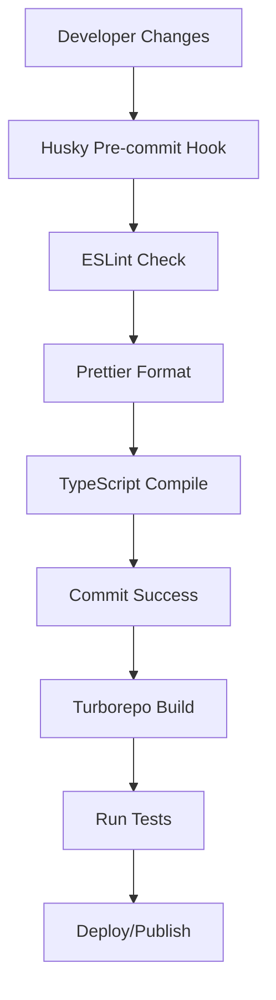

# Phase 1: Setup & Scaffolding Implementation

This document outlines the implementation of Phase 1 features including monorepo setup, tooling configuration, and basic package scaffolding.

## 🎯 Features Implemented

### ⚙️ Repository Initialization

#### Monorepo Setup
- **Turborepo Configuration** - Fast, intelligent build system for monorepos
- **Workspace Management** - Multi-package architecture with shared dependencies
- **Git Setup** - Version control with proper .gitignore configurations
- **Environment Management** - Centralized .env handling across packages

#### Development Tooling
- **ESLint Integration** - Consistent code quality and style enforcement
- **Prettier Formatting** - Automated code formatting across all packages
- **Husky Git Hooks** - Pre-commit linting and testing automation
- **TypeScript Configuration** - Shared TypeScript configs with strict type checking

### 🎮 Client Application Setup

#### React + Vite Foundation
- **Modern Build System** - Vite for fast development and optimized production builds
- **React 18 Features** - Latest React with concurrent features and StrictMode
- **TypeScript Integration** - Full type safety across the client application
- **Hot Module Replacement** - Instant development feedback

#### 3D Graphics Stack
- **React Three Fiber** - React renderer for Three.js with declarative 3D scenes
- **Drei Helpers** - Pre-built components for cameras, controls, and effects
- **Performance Monitoring** - r3f-perf for real-time 3D performance analysis
- **Debug Controls** - Leva for interactive parameter tweaking during development

#### State Management
- **Zustand Store** - Lightweight, scalable state management solution
- **TypeScript Integration** - Fully typed store interfaces and actions
- **Persistence Support** - Built-in local storage persistence capabilities

### 🖥️ Server Infrastructure

#### Express.js Backend
- **Modern Express Setup** - Latest Express with TypeScript support
- **Route Versioning** - API versioning strategy for backward compatibility
- **Middleware Stack** - CORS, authentication, rate limiting, and error handling
- **Development Tools** - Hot reloading with ts-node-dev

#### Database Integration
- **MongoDB Connection** - NoSQL database with Mongoose ODM
- **Connection Management** - Singleton pattern for database connections
- **Schema Modeling** - Mongoose schemas with TypeScript interfaces
- **Environment Configuration** - Flexible connection string management

#### Real-time Communication
- **Socket.io Integration** - WebSocket support for real-time game communication
- **CORS Configuration** - Proper cross-origin setup for development and production
- **Event Handling** - Structured event system for client-server communication

### 📦 Shared Package Architecture

#### Type Definitions
- **Shared Interfaces** - Common TypeScript types across client and server
- **Game Schema Types** - Strongly typed game action and event definitions
- **API Response Types** - Consistent API response structures

#### Validation System
- **Zod Integration** - Runtime type validation and parsing
- **Schema Definitions** - Reusable validation schemas for game actions
- **Type Inference** - Automatic TypeScript type generation from schemas

#### Utility Functions
- **Common Helpers** - Shared utility functions across packages
- **Constants Management** - Centralized game constants and configurations
- **Error Handling** - Standardized error types and handling utilities

## 🏗️ Architecture

### Monorepo Structure

```
GameBoilerplate/
├── .github/
│   └── workflows/
│       └── ci.yml              # GitHub Actions CI/CD pipeline
├── packages/
│   ├── client/                 # React + Vite frontend application
│   │   ├── src/
│   │   │   ├── App.tsx        # Main application component
│   │   │   ├── main.tsx       # React application entry point
│   │   │   └── setupTests.ts  # Testing configuration
│   │   ├── index.html         # HTML template
│   │   ├── package.json       # Client dependencies
│   │   ├── tsconfig.json      # TypeScript configuration
│   │   └── vite.config.ts     # Vite build configuration
│   ├── admin/                  # Admin dashboard (similar to client)
│   │   └── ...                # Same structure as client
│   ├── server/                 # Express.js backend API
│   │   ├── src/
│   │   │   ├── index.ts       # Server entry point
│   │   │   └── index.test.ts  # Basic server tests
│   │   ├── package.json       # Server dependencies
│   │   └── tsconfig.json      # Server TypeScript config
│   └── shared/                 # Shared types and utilities
│       ├── src/
│       │   ├── index.ts       # Main exports
│       │   ├── index.test.ts  # Shared utility tests
│       │   ├── example.test.ts # Example test patterns
│       │   └── actionSchemas.test.ts # Schema validation tests
│       ├── package.json       # Shared package config
│       ├── tsconfig.json      # Shared TypeScript config
│       └── jest.config.js     # Jest testing configuration
├── tests/                      # Integration and E2E tests
│   ├── smoke.test.ts          # Basic smoke tests
│   ├── visual-regression.test.ts # Visual regression tests
│   ├── playwright.config.ts   # Playwright E2E configuration
│   └── package.json           # Test dependencies
├── .env.example               # Environment template
├── package.json               # Root package configuration
├── tsconfig.base.json         # Base TypeScript configuration
├── turbo.json                 # Turborepo configuration
├── .eslintrc.json            # ESLint rules
├── .prettierrc               # Prettier formatting rules
└── .gitignore                # Git ignore patterns
```

### Development Workflow



## 🛠️ Technology Stack

### Frontend Stack
- **React 18** - Modern React with concurrent features
- **Vite 7** - Next-generation frontend build tool
- **TypeScript 5** - Static type checking and enhanced IDE support
- **Three.js + R3F** - 3D graphics rendering and React integration
- **Zustand** - Lightweight state management
- **React Testing Library** - Component testing utilities

### Backend Stack
- **Node.js** - JavaScript runtime environment
- **Express.js 4** - Web application framework
- **TypeScript 5** - Type-safe server development
- **MongoDB + Mongoose** - NoSQL database with ODM
- **Socket.io 4** - Real-time bidirectional communication
- **Jest** - JavaScript testing framework

### Development Tools
- **Turborepo** - Monorepo build system with caching
- **ESLint** - Code linting and style enforcement
- **Prettier** - Code formatting automation
- **Husky** - Git hooks for quality gates
- **ts-node-dev** - TypeScript development server
- **Playwright** - End-to-end testing framework

## 🚀 Getting Started

### Prerequisites
```bash
# Required software
Node.js >= 18.0.0
npm >= 9.0.0
Git >= 2.40.0
```

### Installation
```bash
# Clone the repository
git clone <repository-url>
cd GameBoilerplate

# Install all dependencies
npm install

# Build shared package first
cd packages/shared
npm run build
cd ../..

# Build all packages
npm run build --workspaces
```

### Development Commands

#### Root Level Commands
```bash
# Install all dependencies
npm install

# Build all packages
npm run build --workspaces

# Run tests across all packages
npm test --workspaces

# Lint all code
npm run lint

# Format all code
npm run format

# Git hooks setup
npm run prepare
```

#### Package-Specific Commands
```bash
# Client development
cd packages/client
npm run dev          # Start dev server on http://localhost:5173
npm run build        # Build for production
npm run preview      # Preview production build

# Server development
cd packages/server
npm run dev          # Start dev server with hot reload
npm run build        # Compile TypeScript
npm run start        # Start production server

# Admin development
cd packages/admin
npm run dev          # Start admin dev server on http://localhost:5174
npm run build        # Build admin dashboard
npm run preview      # Preview admin build

# Shared package
cd packages/shared
npm run build        # Build shared types and utilities
npm test             # Run shared package tests
```

## 🧪 Testing Strategy

### Unit Testing
- **Jest Configuration** - Shared testing setup across packages
- **React Testing Library** - Component testing for React applications
- **Test Coverage** - Code coverage reporting and thresholds
- **Snapshot Testing** - UI component snapshot comparisons

### Integration Testing
- **API Testing** - Server endpoint testing with supertest
- **Database Testing** - MongoDB integration tests with test database
- **WebSocket Testing** - Real-time communication testing

### End-to-End Testing
- **Playwright Setup** - Browser automation and testing
- **Visual Regression** - Screenshot comparison testing
- **Smoke Tests** - Basic functionality verification

### Testing Commands
```bash
# Run all tests
npm test --workspaces

# Run tests with coverage
npm run test:coverage --workspaces

# Run E2E tests
cd tests
npm run test:e2e

# Run visual regression tests
npm run test:visual
```

## 📝 Configuration Files

### TypeScript Configuration
```json
// tsconfig.base.json - Shared TypeScript settings
{
  "compilerOptions": {
    "target": "ES2022",
    "lib": ["ES2022", "DOM", "DOM.Iterable"],
    "module": "ESNext",
    "moduleResolution": "bundler",
    "strict": true,
    "skipLibCheck": true,
    "esModuleInterop": true,
    "allowSyntheticDefaultImports": true,
    "forceConsistentCasingInFileNames": true
  }
}
```

### Turborepo Configuration
```json
// turbo.json - Build and cache configuration
{
  "pipeline": {
    "build": {
      "dependsOn": ["^build"],
      "outputs": ["dist/**", ".next/**"]
    },
    "test": {
      "dependsOn": ["build"]
    },
    "lint": {
      "dependsOn": ["build"]
    }
  }
}
```

### ESLint Configuration
```json
// .eslintrc.json - Linting rules
{
  "extends": [
    "eslint:recommended",
    "@typescript-eslint/recommended",
    "prettier"
  ],
  "plugins": ["@typescript-eslint", "prettier"],
  "rules": {
    "prettier/prettier": "error",
    "@typescript-eslint/no-unused-vars": "error"
  }
}
```

## 🔧 Environment Setup

### Environment Variables
```bash
# .env.example template
# Server Configuration
PORT=3001
NODE_ENV=development

# Database Configuration  
MONGODB_URI=mongodb://localhost:27017/gameboilerplate

# JWT Configuration
JWT_SECRET=your_jwt_secret_here
JWT_EXPIRES_IN=24h

# Development Settings
VITE_API_URL=http://localhost:3001
VITE_WS_URL=ws://localhost:3001
```

### Development Services
```bash
# Start MongoDB (Docker)
docker run -d -p 27017:27017 --name mongodb mongo:latest

# Start Redis (Optional caching)
docker run -d -p 6379:6379 --name redis redis:latest

# Monitor logs
docker logs -f mongodb
docker logs -f redis
```

## 📊 Package Dependencies

### Shared Dependencies
- **TypeScript** - Type checking across all packages
- **ESLint** - Code quality enforcement
- **Prettier** - Code formatting consistency
- **Jest** - Testing framework

### Client-Specific Dependencies
- **React + React DOM** - UI library and rendering
- **Vite** - Build tool and dev server
- **@react-three/fiber** - React renderer for Three.js
- **@react-three/drei** - Useful helpers for R3F
- **zustand** - State management
- **socket.io-client** - WebSocket client

### Server-Specific Dependencies
- **Express** - Web application framework
- **mongoose** - MongoDB object modeling
- **socket.io** - WebSocket server
- **cors** - Cross-origin resource sharing
- **dotenv** - Environment variable loading

## 🛡️ Quality Assurance

### Code Quality Gates
- **Pre-commit Hooks** - Automatic linting and formatting
- **TypeScript Compilation** - Type checking before commits
- **Test Execution** - Unit tests must pass
- **Build Verification** - All packages must build successfully

### Continuous Integration
```yaml
# .github/workflows/ci.yml
name: CI
on: [push, pull_request]
jobs:
  test:
    runs-on: ubuntu-latest
    steps:
      - uses: actions/checkout@v3
      - uses: actions/setup-node@v3
        with:
          node-version: '18'
      - run: npm install
      - run: npm run lint
      - run: npm run build --workspaces
      - run: npm test --workspaces
```

## 🔄 Migration from Other Setups

### From Create React App
1. Replace `react-scripts` with Vite configuration
2. Update imports to use Vite-style asset handling
3. Migrate to new testing setup if needed

### From Standalone Express
1. Move server code into `packages/server`
2. Update imports to use shared package
3. Configure TypeScript and build process

### Adding New Packages
```bash
# Create new package
mkdir packages/new-package
cd packages/new-package
npm init -y

# Add to workspace
# Edit root package.json workspaces array
# Add package-specific dependencies
npm install

# Configure TypeScript
# Copy tsconfig.json from similar package
# Update paths and configurations as needed
```

## 🛠️ Troubleshooting

### Common Issues

#### Build Failures
```bash
# Clear node_modules and reinstall
rm -rf node_modules package-lock.json
rm -rf packages/*/node_modules
npm install

# Clear Turborepo cache
npx turbo clean
```

#### TypeScript Errors
```bash
# Rebuild shared package first
cd packages/shared
npm run build

# Check for circular dependencies
npm run build --verbose
```

#### Port Conflicts
```bash
# Check what's running on ports
netstat -tulpn | grep :3001
netstat -tulpn | grep :5173

# Kill processes if needed
pkill -f "node.*3001"
pkill -f "vite.*5173"
```

## 🎯 Phase 1 Success Criteria

### ✅ Repository Setup
- [x] Turborepo monorepo structure
- [x] TypeScript configuration across all packages
- [x] ESLint and Prettier setup with pre-commit hooks
- [x] Environment file management

### ✅ Client Application
- [x] React + Vite setup with TypeScript
- [x] Three.js and React Three Fiber integration
- [x] Zustand state management
- [x] Development and build tooling

### ✅ Server Infrastructure
- [x] Express.js with TypeScript
- [x] MongoDB connection setup
- [x] Socket.io integration
- [x] Basic middleware stack

### ✅ Shared Package
- [x] TypeScript interfaces and types
- [x] Zod validation schemas
- [x] Utility functions and constants
- [x] Testing setup with Jest

### ✅ Development Workflow
- [x] Hot reloading for all packages
- [x] Automated testing pipeline
- [x] Code quality enforcement
- [x] Documentation and examples

Phase 1 provides a solid foundation for rapid development of multiplayer games with modern tooling, type safety, and scalable architecture. The monorepo structure enables code sharing while maintaining package isolation, and the development workflow ensures high code quality throughout the project lifecycle.
