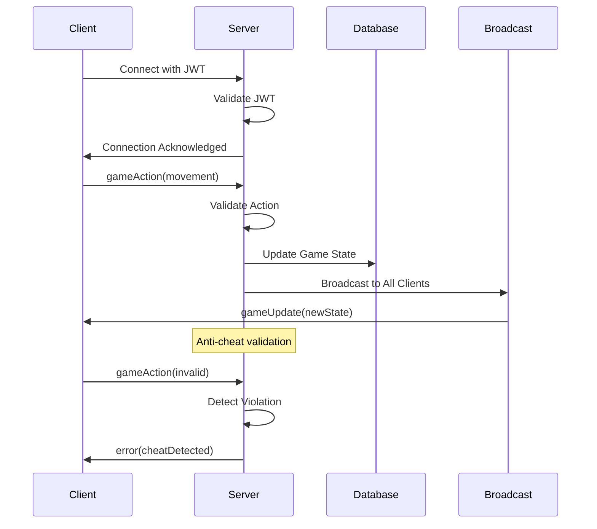

# Phase 2: WebSocket Implementation

This document outlines the implementation of Phase 2 features including real-time WebSocket communication, game action handling, and server broadcasting system.

## 🎯 Features Implemented

### 🔌 WebSocket Communication

#### Client-Server Connection
- **Socket.io Integration** - Robust WebSocket implementation with fallback support
- **JWT Authentication** - Secure token-based connection authentication
- **Connection Management** - Automatic reconnection and error handling
- **Event System** - Structured game action and response handling

#### Real-time Game Actions
- **Action Broadcasting** - Client actions sent to server via WebSocket
- **State Synchronization** - Server broadcasts game state updates
- **Error Handling** - Anti-cheat violations and validation errors
- **Event Queuing** - Reliable message delivery with acknowledgments

### 🎮 Game Action System

#### Client-Side Actions
- **Movement Actions** - Player position and rotation updates
- **Game Events** - Item interactions, combat actions, and game state changes
- **Input Validation** - Client-side validation before server transmission
- **Action Queuing** - Offline action storage and replay

#### Server-Side Processing
- **Action Validation** - Server-side game rule enforcement
- **State Updates** - Authoritative game state management
- **Broadcasting** - Multi-client state synchronization
- **Error Responses** - Detailed validation failure feedback

### 🛡️ Anti-Cheat Foundation

#### Server Authority
- **Game State Validation** - All actions validated against server game rules
- **Illegal Action Detection** - Prevention of impossible moves and actions
- **Rate Limiting** - Action frequency monitoring and enforcement
- **Client Trust Model** - Zero-trust approach to client-submitted data

#### Error Broadcasting
- **Validation Failures** - Immediate feedback on rejected actions
- **Cheat Detection** - Suspicious activity logging and response
- **Client Correction** - Server-authoritative state correction
- **Administrative Alerts** - Real-time notifications for severe violations

## 🏗️ Architecture

### WebSocket Communication Flow



### Event System Architecture

```
Client Application
├── WebSocket Connection
│   ├── Authentication Layer (JWT)
│   ├── Action Dispatcher
│   ├── Event Listeners
│   └── Error Handlers
├── Game Action Types
│   ├── Movement Events
│   ├── Combat Events
│   ├── Item Events
│   └── System Events
└── State Synchronization
    ├── Local State Updates
    ├── Server State Merging
    └── Conflict Resolution

Server Application
├── WebSocket Server
│   ├── Connection Management
│   ├── Authentication Middleware
│   ├── Action Validators
│   └── Broadcast System
├── Game Logic Engine
│   ├── State Management
│   ├── Rule Validation
│   ├── Anti-cheat Systems
│   └── Event Processing
└── Database Integration
    ├── Game State Persistence
    ├── Action Logging
    └── Player Data Management
```

## 🛠️ Implementation Details

### Client-Side WebSocket Setup

#### Connection Initialization
```typescript
// packages/client/src/services/websocket.ts
import { io, Socket } from 'socket.io-client';
import { GameAction, GameState } from '@shared/types';

class WebSocketService {
  private socket: Socket | null = null;
  private reconnectAttempts = 0;
  private maxReconnectAttempts = 5;

  connect(token: string): Promise<void> {
    return new Promise((resolve, reject) => {
      this.socket = io(process.env.VITE_WS_URL, {
        auth: { token },
        transports: ['websocket', 'polling'],
        timeout: 5000,
        retries: 3
      });

      this.socket.on('connect', () => {
        console.log('Connected to game server');
        this.reconnectAttempts = 0;
        resolve();
      });

      this.socket.on('disconnect', () => {
        console.log('Disconnected from game server');
        this.handleReconnection();
      });

      this.socket.on('connect_error', (error) => {
        console.error('Connection failed:', error);
        reject(error);
      });

      this.setupGameEventListeners();
    });
  }

  sendGameAction(action: GameAction): void {
    if (!this.socket?.connected) {
      console.warn('Socket not connected, queuing action');
      this.queueAction(action);
      return;
    }

    this.socket.emit('gameAction', action, (response) => {
      if (response.error) {
        console.error('Action rejected:', response.error);
        this.handleActionRejection(action, response.error);
      }
    });
  }

  private setupGameEventListeners(): void {
    this.socket?.on('gameUpdate', (gameState: GameState) => {
      this.handleGameUpdate(gameState);
    });

    this.socket?.on('error', (error) => {
      this.handleServerError(error);
    });

    this.socket?.on('playerJoined', (player) => {
      this.handlePlayerJoined(player);
    });

    this.socket?.on('playerLeft', (player) => {
      this.handlePlayerLeft(player);
    });
  }
}
```

#### Game Action Types
```typescript
// packages/shared/src/types/gameActions.ts
export interface GameAction {
  type: 'movement' | 'combat' | 'item' | 'chat';
  playerId: string;
  timestamp: number;
  data: ActionData;
}

export interface MovementAction extends GameAction {
  type: 'movement';
  data: {
    position: { x: number; y: number; z: number };
    rotation: { x: number; y: number; z: number };
    velocity: { x: number; y: number; z: number };
  };
}

export interface CombatAction extends GameAction {
  type: 'combat';
  data: {
    targetId?: string;
    ability: string;
    direction: { x: number; y: number; z: number };
  };
}

export interface ItemAction extends GameAction {
  type: 'item';
  data: {
    itemId: string;
    action: 'pickup' | 'drop' | 'use' | 'equip';
    targetId?: string;
  };
}
```

### Server-Side WebSocket Handling

#### Socket.io Server Configuration
```typescript
// packages/server/src/websocket/server.ts
import { Server as SocketServer } from 'socket.io';
import { Server as HttpServer } from 'http';
import { authenticateSocket } from '../middleware/auth';
import { GameActionHandler } from './gameActionHandler';
import { AntiCheatService } from '../services/AntiCheatService';

export class WebSocketServer {
  private io: SocketServer;
  private gameActionHandler: GameActionHandler;
  private antiCheatService: AntiCheatService;

  constructor(httpServer: HttpServer) {
    this.io = new SocketServer(httpServer, {
      cors: {
        origin: process.env.CLIENT_URL || "http://localhost:5173",
        methods: ["GET", "POST"],
        credentials: true
      },
      transports: ['websocket', 'polling']
    });

    this.gameActionHandler = new GameActionHandler();
    this.antiCheatService = new AntiCheatService();
    this.setupMiddleware();
    this.setupEventHandlers();
  }

  private setupMiddleware(): void {
    this.io.use(authenticateSocket);
  }

  private setupEventHandlers(): void {
    this.io.on('connection', (socket) => {
      console.log(`Player connected: ${socket.userId}`);
      
      socket.join('game-room');
      this.broadcastPlayerJoined(socket);

      socket.on('gameAction', async (action, callback) => {
        try {
          // Anti-cheat validation
          const isValid = await this.antiCheatService.validateAction(
            socket.userId,
            action
          );

          if (!isValid) {
            callback({ error: 'Invalid action detected' });
            this.handleCheatDetection(socket, action);
            return;
          }

          // Process valid action
          const result = await this.gameActionHandler.processAction(
            socket.userId,
            action
          );

          // Broadcast updates to all clients
          this.broadcastGameUpdate(result.gameState);
          
          callback({ success: true, result });
        } catch (error) {
          console.error('Action processing error:', error);
          callback({ error: 'Action processing failed' });
        }
      });

      socket.on('disconnect', () => {
        console.log(`Player disconnected: ${socket.userId}`);
        this.broadcastPlayerLeft(socket);
      });
    });
  }

  private broadcastGameUpdate(gameState: GameState): void {
    this.io.to('game-room').emit('gameUpdate', gameState);
  }

  private broadcastPlayerJoined(socket: any): void {
    socket.to('game-room').emit('playerJoined', {
      playerId: socket.userId,
      timestamp: Date.now()
    });
  }

  private broadcastPlayerLeft(socket: any): void {
    socket.to('game-room').emit('playerLeft', {
      playerId: socket.userId,
      timestamp: Date.now()
    });
  }

  private handleCheatDetection(socket: any, action: GameAction): void {
    console.warn(`Cheat detected from player ${socket.userId}:`, action);
    
    // Log the incident
    this.antiCheatService.logSuspiciousActivity(socket.userId, action);
    
    // Broadcast anti-cheat error
    socket.emit('error', {
      type: 'cheat_detected',
      message: 'Invalid action rejected',
      action: action.type
    });
  }
}
```

#### Game Action Processing
```typescript
// packages/server/src/websocket/gameActionHandler.ts
import { GameAction, GameState } from '@shared/types';
import { GameStateService } from '../services/GameStateService';

export class GameActionHandler {
  private gameStateService: GameStateService;

  constructor() {
    this.gameStateService = new GameStateService();
  }

  async processAction(playerId: string, action: GameAction) {
    switch (action.type) {
      case 'movement':
        return this.handleMovementAction(playerId, action);
      case 'combat':
        return this.handleCombatAction(playerId, action);
      case 'item':
        return this.handleItemAction(playerId, action);
      default:
        throw new Error(`Unknown action type: ${action.type}`);
    }
  }

  private async handleMovementAction(playerId: string, action: MovementAction) {
    // Validate movement constraints
    const currentPosition = await this.gameStateService.getPlayerPosition(playerId);
    const newPosition = action.data.position;
    
    // Check for teleportation or impossible movement
    const distance = this.calculateDistance(currentPosition, newPosition);
    const maxDistance = this.calculateMaxMovementDistance(action.timestamp);
    
    if (distance > maxDistance) {
      throw new Error('Movement distance exceeds maximum allowed');
    }

    // Update player position
    await this.gameStateService.updatePlayerPosition(playerId, newPosition);
    
    // Return updated game state
    return {
      gameState: await this.gameStateService.getCurrentState(),
      playerId,
      action: 'movement'
    };
  }

  private async handleCombatAction(playerId: string, action: CombatAction) {
    // Validate combat rules
    const player = await this.gameStateService.getPlayer(playerId);
    const target = action.data.targetId ? 
      await this.gameStateService.getPlayer(action.data.targetId) : null;

    // Check range, cooldowns, resources
    if (!this.validateCombatAction(player, target, action)) {
      throw new Error('Invalid combat action');
    }

    // Process combat effects
    const result = await this.gameStateService.processCombat(player, target, action);
    
    return {
      gameState: await this.gameStateService.getCurrentState(),
      combatResult: result,
      action: 'combat'
    };
  }

  private async handleItemAction(playerId: string, action: ItemAction) {
    const player = await this.gameStateService.getPlayer(playerId);
    const item = await this.gameStateService.getItem(action.data.itemId);

    switch (action.data.action) {
      case 'pickup':
        await this.gameStateService.playerPickupItem(playerId, action.data.itemId);
        break;
      case 'drop':
        await this.gameStateService.playerDropItem(playerId, action.data.itemId);
        break;
      case 'use':
        await this.gameStateService.playerUseItem(playerId, action.data.itemId);
        break;
      case 'equip':
        await this.gameStateService.playerEquipItem(playerId, action.data.itemId);
        break;
    }

    return {
      gameState: await this.gameStateService.getCurrentState(),
      action: 'item'
    };
  }
}
```

### Anti-Cheat Integration

#### Basic Anti-Cheat Validation
```typescript
// packages/server/src/services/AntiCheatService.ts
export class AntiCheatService {
  private actionHistory: Map<string, GameAction[]> = new Map();
  private lastActionTime: Map<string, number> = new Map();

  async validateAction(playerId: string, action: GameAction): Promise<boolean> {
    // Rate limiting
    if (!this.validateActionRate(playerId, action)) {
      return false;
    }

    // Action-specific validation
    switch (action.type) {
      case 'movement':
        return this.validateMovement(playerId, action);
      case 'combat':
        return this.validateCombat(playerId, action);
      case 'item':
        return this.validateItemAction(playerId, action);
      default:
        return false;
    }
  }

  private validateActionRate(playerId: string, action: GameAction): boolean {
    const now = Date.now();
    const lastAction = this.lastActionTime.get(playerId) || 0;
    const minInterval = this.getMinActionInterval(action.type);

    if (now - lastAction < minInterval) {
      this.logSuspiciousActivity(playerId, action, 'rate_limit_exceeded');
      return false;
    }

    this.lastActionTime.set(playerId, now);
    return true;
  }

  private validateMovement(playerId: string, action: MovementAction): boolean {
    const history = this.getPlayerActionHistory(playerId);
    const lastMovement = history
      .filter(a => a.type === 'movement')
      .slice(-1)[0] as MovementAction;

    if (!lastMovement) return true;

    // Check for impossible movement speed
    const timeDiff = action.timestamp - lastMovement.timestamp;
    const distance = this.calculateDistance(
      lastMovement.data.position,
      action.data.position
    );
    
    const maxSpeed = 10; // units per second
    const maxDistance = (maxSpeed * timeDiff) / 1000;

    if (distance > maxDistance) {
      this.logSuspiciousActivity(playerId, action, 'impossible_movement');
      return false;
    }

    return true;
  }

  logSuspiciousActivity(playerId: string, action: GameAction, reason?: string): void {
    console.warn(`Suspicious activity detected:`, {
      playerId,
      action: action.type,
      reason,
      timestamp: new Date().toISOString(),
      actionData: action.data
    });

    // Store in database for further analysis
    // Could trigger automatic bans or admin alerts
  }
}
```

## 🔧 Configuration

### Environment Variables
```bash
# WebSocket Configuration
WS_PORT=3001
WS_CORS_ORIGIN=http://localhost:5173

# Client Configuration  
VITE_WS_URL=ws://localhost:3001
VITE_API_URL=http://localhost:3001

# Anti-cheat Settings
MAX_ACTIONS_PER_SECOND=10
MAX_MOVEMENT_SPEED=10
CHEAT_DETECTION_THRESHOLD=3
```

### Socket.io Configuration
```typescript
// Client configuration
const socketConfig = {
  autoConnect: false,
  transports: ['websocket', 'polling'],
  timeout: 5000,
  retries: 3,
  reconnection: true,
  reconnectionDelay: 1000,
  reconnectionAttempts: 5,
  maxReconnectionAttempts: 10
};

// Server configuration
const serverConfig = {
  cors: {
    origin: process.env.CLIENT_URL,
    methods: ["GET", "POST"],
    credentials: true
  },
  transports: ['websocket', 'polling'],
  pingTimeout: 60000,
  pingInterval: 25000
};
```

## 🧪 Testing Strategy

### WebSocket Testing
```typescript
// packages/server/src/__tests__/websocket.test.ts
import { createServer } from 'http';
import { Server } from 'socket.io';
import Client from 'socket.io-client';
import { WebSocketServer } from '../websocket/server';

describe('WebSocket Server', () => {
  let httpServer: any;
  let wsServer: WebSocketServer;
  let clientSocket: any;

  beforeEach((done) => {
    httpServer = createServer();
    wsServer = new WebSocketServer(httpServer);
    
    httpServer.listen(() => {
      const port = httpServer.address().port;
      clientSocket = Client(`http://localhost:${port}`, {
        auth: { token: 'test-jwt-token' }
      });
      
      clientSocket.on('connect', done);
    });
  });

  afterEach(() => {
    wsServer.close();
    clientSocket.close();
    httpServer.close();
  });

  test('should handle game actions', (done) => {
    const gameAction = {
      type: 'movement',
      playerId: 'test-player',
      timestamp: Date.now(),
      data: {
        position: { x: 1, y: 0, z: 1 },
        rotation: { x: 0, y: 0, z: 0 },
        velocity: { x: 0, y: 0, z: 0 }
      }
    };

    clientSocket.emit('gameAction', gameAction, (response) => {
      expect(response.success).toBe(true);
      done();
    });
  });

  test('should broadcast game updates', (done) => {
    clientSocket.on('gameUpdate', (gameState) => {
      expect(gameState).toBeDefined();
      expect(gameState.players).toBeDefined();
      done();
    });

    // Trigger an action that causes a broadcast
    clientSocket.emit('gameAction', {
      type: 'movement',
      playerId: 'test-player',
      timestamp: Date.now(),
      data: { position: { x: 0, y: 0, z: 0 } }
    });
  });

  test('should reject invalid actions', (done) => {
    const invalidAction = {
      type: 'movement',
      playerId: 'test-player',
      timestamp: Date.now(),
      data: {
        position: { x: 1000000, y: 0, z: 0 } // Impossible teleportation
      }
    };

    clientSocket.emit('gameAction', invalidAction, (response) => {
      expect(response.error).toBeDefined();
      expect(response.error).toContain('Invalid action');
      done();
    });
  });
});
```

### Client-Side Testing
```typescript
// packages/client/src/__tests__/websocket.test.ts
import { WebSocketService } from '../services/websocket';

describe('WebSocket Service', () => {
  let wsService: WebSocketService;

  beforeEach(() => {
    wsService = new WebSocketService();
  });

  test('should connect with valid token', async () => {
    const mockToken = 'valid-jwt-token';
    
    // Mock successful connection
    jest.spyOn(io, 'connect').mockReturnValue({
      on: jest.fn((event, callback) => {
        if (event === 'connect') callback();
      }),
      emit: jest.fn(),
      connected: true
    });

    await expect(wsService.connect(mockToken)).resolves.toBeUndefined();
  });

  test('should queue actions when disconnected', () => {
    const action = {
      type: 'movement',
      playerId: 'test-player',
      timestamp: Date.now(),
      data: { position: { x: 1, y: 0, z: 1 } }
    };

    // Service is not connected
    wsService.sendGameAction(action);

    // Verify action was queued
    expect(wsService.getQueuedActions()).toContain(action);
  });
});
```

## 🚀 Usage Examples

### Basic Client Setup
```typescript
// packages/client/src/hooks/useWebSocket.ts
import { useEffect, useState } from 'react';
import { WebSocketService } from '../services/websocket';

export const useWebSocket = (token: string) => {
  const [wsService] = useState(() => new WebSocketService());
  const [connected, setConnected] = useState(false);
  const [gameState, setGameState] = useState(null);

  useEffect(() => {
    if (token) {
      wsService.connect(token).then(() => {
        setConnected(true);
      }).catch(console.error);

      wsService.onGameUpdate((state) => {
        setGameState(state);
      });
    }

    return () => {
      wsService.disconnect();
    };
  }, [token, wsService]);

  const sendAction = (action: GameAction) => {
    wsService.sendGameAction(action);
  };

  return { connected, gameState, sendAction };
};
```

### Game Component Integration
```typescript
// packages/client/src/components/Game.tsx
import React from 'react';
import { useWebSocket } from '../hooks/useWebSocket';
import { useAuthStore } from '../stores/authStore';

export const Game: React.FC = () => {
  const { token } = useAuthStore();
  const { connected, gameState, sendAction } = useWebSocket(token);

  const handlePlayerMovement = (position: { x: number; y: number; z: number }) => {
    sendAction({
      type: 'movement',
      playerId: 'current-player',
      timestamp: Date.now(),
      data: { position, rotation: { x: 0, y: 0, z: 0 }, velocity: { x: 0, y: 0, z: 0 } }
    });
  };

  if (!connected) {
    return <div>Connecting to game server...</div>;
  }

  return (
    <div>
      <h2>Game Connected</h2>
      <p>Players online: {gameState?.players?.length || 0}</p>
      {/* Game rendering components */}
    </div>
  );
};
```

## 📊 Performance Monitoring

### WebSocket Metrics
- **Connection Count** - Number of active WebSocket connections
- **Message Rate** - Actions per second processed by server
- **Latency** - Round-trip time for action acknowledgments
- **Error Rate** - Percentage of failed or rejected actions

### Anti-Cheat Metrics
- **Validation Rate** - Actions validated per second
- **Rejection Rate** - Percentage of actions rejected
- **Cheat Detection** - Suspicious activities flagged
- **False Positives** - Legitimate actions incorrectly flagged

### Monitoring Tools
```typescript
// packages/server/src/monitoring/websocketMetrics.ts
export class WebSocketMetrics {
  private connectionCount = 0;
  private messageCount = 0;
  private errorCount = 0;
  private startTime = Date.now();

  incrementConnections(): void {
    this.connectionCount++;
  }

  decrementConnections(): void {
    this.connectionCount--;
  }

  incrementMessages(): void {
    this.messageCount++;
  }

  incrementErrors(): void {
    this.errorCount++;
  }

  getMetrics() {
    const uptime = Date.now() - this.startTime;
    return {
      connections: this.connectionCount,
      totalMessages: this.messageCount,
      messagesPerSecond: this.messageCount / (uptime / 1000),
      totalErrors: this.errorCount,
      errorRate: this.errorCount / this.messageCount,
      uptimeMs: uptime
    };
  }
}
```

## 🛡️ Security Considerations

### JWT Authentication
- **Token Validation** - Every WebSocket connection authenticated
- **Token Expiration** - Automatic disconnection on token expiry
- **Refresh Mechanism** - Seamless token renewal during gameplay

### Rate Limiting
- **Action Throttling** - Maximum actions per second per player
- **Connection Limits** - Maximum connections per IP address
- **Burst Protection** - Temporary action queuing for legitimate bursts

### Data Validation
- **Input Sanitization** - All client data validated and sanitized
- **Schema Validation** - Zod schemas for type safety and validation
- **Boundary Checking** - Game world boundaries and constraints enforced

## 🔄 Migration and Upgrades

### From HTTP to WebSocket
1. Replace REST API calls with WebSocket events
2. Update state management to handle real-time updates
3. Implement reconnection logic and offline handling
4. Add action queuing for network interruptions

### Socket.io Version Upgrades
1. Review breaking changes in Socket.io documentation
2. Update client and server configurations
3. Test reconnection and fallback mechanisms
4. Validate authentication flow compatibility

## 🎯 Phase 2 Success Criteria

### ✅ WebSocket Infrastructure
- [x] Socket.io server and client integration
- [x] JWT-based connection authentication
- [x] Reliable connection management with reconnection
- [x] Structured event system for game actions

### ✅ Real-time Communication
- [x] Game action transmission from client to server
- [x] Server broadcasting of game state updates
- [x] Error handling and validation feedback
- [x] Multi-client synchronization

### ✅ Anti-Cheat Foundation
- [x] Server-side action validation
- [x] Rate limiting and suspicious activity detection
- [x] Impossible action prevention (teleportation, speed hacks)
- [x] Comprehensive logging for cheat analysis

### ✅ Developer Experience
- [x] TypeScript interfaces for all WebSocket events
- [x] Comprehensive testing suite for WebSocket functionality
- [x] Clear error messages and debugging tools
- [x] Performance monitoring and metrics collection

Phase 2 establishes the real-time communication backbone essential for multiplayer games. The WebSocket implementation provides low-latency action transmission while the anti-cheat foundation ensures game integrity. This phase enables immediate feedback and synchronization between multiple players in a secure, validated environment.
