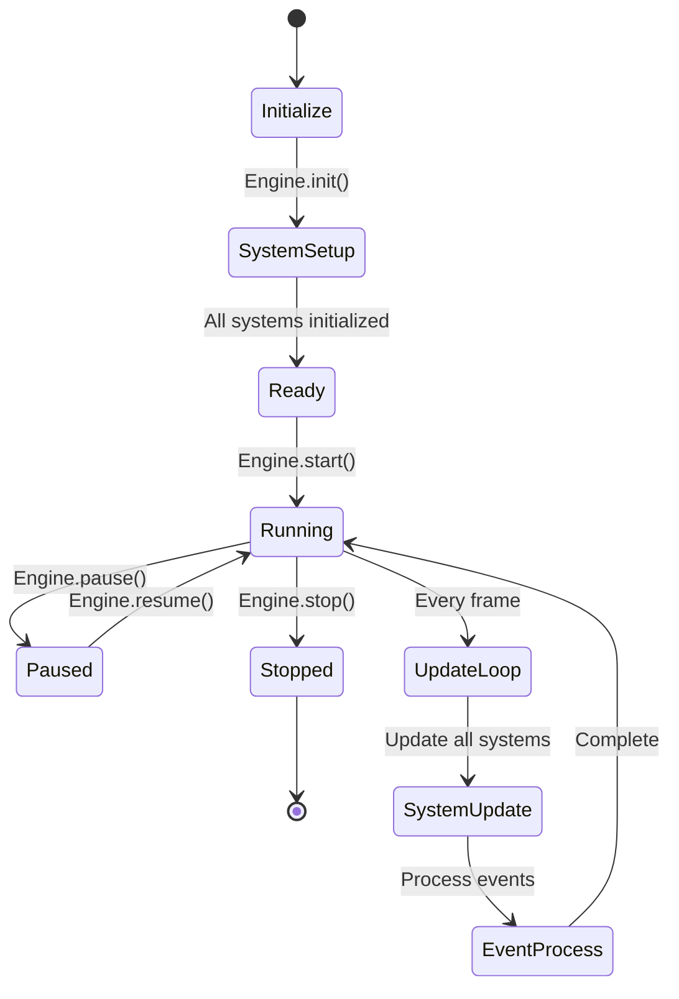
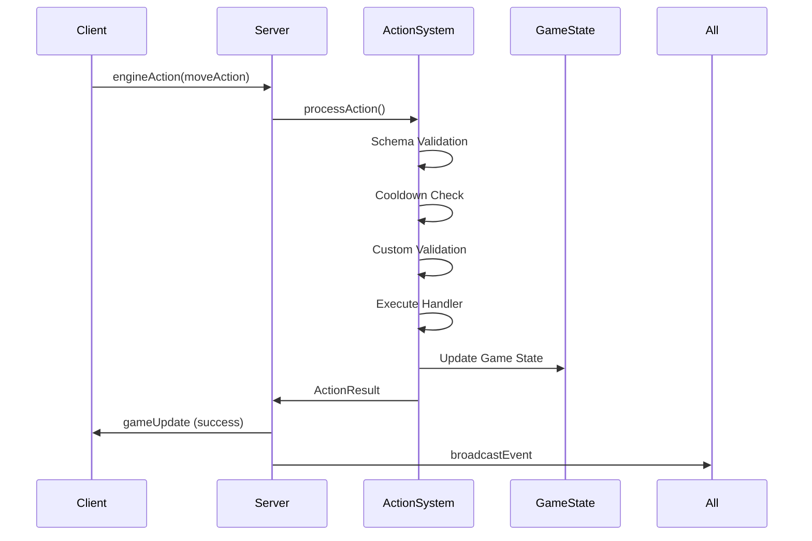

# Phase 5: Boilerplate Engineizing

> Transform the game boilerplate into an extensible, engine-level framework for rapid game development.

---

## 🎯 Phase 5 Overview

Phase 5 transforms the GameBoilerplate from a simple game prototype into a comprehensive, extensible game engine framework. This phase introduces engine-level abstractions that make it easy to create different types of games while maintaining the robust foundation built in previous phases.

### 🚀 Key Features Implemented

- **🎮 Game Engine Architecture** - Modular, system-based engine with lifecycle management
- **⚙️ Action System** - Extensible action framework with validation and cooldowns
- **🏗️ System Manager** - Pluggable systems for different game mechanics
- **🎬 Scene Management** - Multi-scene support with transitions and state management
- **🔌 Plugin System** - Dynamic plugin loading for extending functionality
- **🌐 Network Integration** - Seamless client-server action synchronization
- **🎨 3D Rendering Pipeline** - React Three Fiber integration with entity rendering
- **📊 Performance Monitoring** - Built-in stats, profiling, and debugging tools

---

## 🏗️ Engine Architecture

### Core Components

```
GameBoilerplate Engine
├── 🎮 Game Engine (Core)
│   ├── Entity Management
│   ├── System Orchestration
│   ├── Game Loop & Timing
│   └── Event System
├── ⚙️ Action System
│   ├── Action Definitions
│   ├── Validation Pipeline
│   ├── Cooldown Management
│   └── Handler Execution
├── 🏗️ System Manager
│   ├── Movement System
│   ├── Physics System
│   ├── Combat System
│   ├── Inventory System
│   └── Render System
├── 🎬 Scene Manager
│   ├── Scene Loading/Unloading
│   ├── Entity Activation
│   ├── System State Management
│   └── Transition Effects
└── 🔌 Plugin System
    ├── Plugin Discovery
    ├── Dependency Resolution
    ├── Runtime Loading
    └── System Integration
```

### Engine Lifecycle



---

## 🎮 Game Engine Core

### Entity-Component-System (ECS) Pattern

```typescript
// Entity Definition
interface GameEntity {
  id: string;
  position: Vector3;
  rotation: Vector3;
  scale: Vector3;
  type: string;
  properties: Record<string, any>;
}

// System Interface
interface System {
  name: string;
  priority: number;
  enabled: boolean;
  
  init?(engine: IGameEngine): Promise<void>;
  update?(deltaTime: number, gameState: GameState): Promise<void>;
  destroy?(): Promise<void>;
}

// Usage Example
const movementSystem = new MovementSystem();
const combatSystem = new CombatSystem();

engine.addSystem(movementSystem);
engine.addSystem(combatSystem);

await engine.init();
await engine.start();
```

### Game Loop Integration

```typescript
// Client-side (React Integration)
function GameComponent() {
  const { engine, isInitialized, isRunning } = useGameEngine({
    tickRate: 60,
    enableDebug: true
  });

  return (
    <GameScene engine={engine}>
      <GameStats engine={engine} />
      <GameControls engine={engine} />
    </GameScene>
  );
}

// Server-side Integration
const serverEngine = new ServerGameEngine(httpServer);
await serverEngine.initialize();
await serverEngine.start();
```

---

## ⚙️ Action System

### Action Definition & Registration

```typescript
// Define Action Schema
const moveActionSchema = z.object({
  direction: z.enum(['up', 'down', 'left', 'right']),
  distance: z.number().min(0).max(10).optional().default(1),
  speed: z.number().min(0.1).max(5).optional().default(1)
});

// Register Action
actionSystem.registerAction({
  type: 'move',
  schema: moveActionSchema,
  cooldown: 100, // 100ms cooldown
  validator: async (data, context) => {
    // Custom validation logic
    return true;
  },
  handler: async (data, context) => {
    const player = context.engine.getEntity(context.userId);
    if (!player) {
      return { success: false, message: 'Player not found' };
    }

    // Apply movement
    switch (data.direction) {
      case 'up': player.position.z -= data.distance; break;
      case 'down': player.position.z += data.distance; break;
      case 'left': player.position.x -= data.distance; break;
      case 'right': player.position.x += data.distance; break;
    }

    return {
      success: true,
      data: { newPosition: player.position },
      events: [{
        type: 'player:moved',
        data: { userId: context.userId, position: player.position },
        timestamp: Date.now()
      }]
    };
  }
});
```

### Client-Server Action Flow



---

## 🏗️ System Manager

### Available Systems

#### Movement System
```typescript
class MovementSystem implements System {
  name = 'MovementSystem';
  priority = 10;
  enabled = true;

  async update(deltaTime: number, gameState: GameState): Promise<void> {
    for (const entity of gameState.entities.values()) {
      if (entity.properties.velocity) {
        // Apply velocity to position
        entity.position.x += entity.properties.velocity.x * deltaTime;
        entity.position.y += entity.properties.velocity.y * deltaTime;
        entity.position.z += entity.properties.velocity.z * deltaTime;
      }
    }
  }
}
```

#### Combat System
```typescript
class CombatSystem implements System {
  name = 'CombatSystem';
  priority = 15;

  async update(deltaTime: number, gameState: GameState): Promise<void> {
    // Update cooldowns, damage over time, health regeneration
    for (const entity of gameState.entities.values()) {
      if (entity.properties.combat) {
        this.updateCombatEntity(entity, deltaTime);
      }
    }
  }
}
```

#### Inventory System
```typescript
class InventorySystem implements System {
  name = 'InventorySystem';
  priority = 20;

  async update(deltaTime: number, gameState: GameState): Promise<void> {
    // Update item durability, expiration, etc.
    for (const entity of gameState.entities.values()) {
      if (entity.properties.inventory) {
        this.updateInventory(entity, deltaTime);
      }
    }
  }
}
```

### Game Type Presets

```typescript
// Install systems for different game types
systemManager.installGameSystems('rpg');     // Movement, Combat, Inventory
systemManager.installGameSystems('shooter'); // Movement, Physics, Combat
systemManager.installGameSystems('puzzle');  // Render only
```

---

## 🎬 Scene Management

### Scene Definition

```typescript
interface Scene {
  id: string;
  name: string;
  entities: string[];
  systems: string[];
  settings: Record<string, any>;
  
  load?(engine: IGameEngine): Promise<void>;
  unload?(engine: IGameEngine): Promise<void>;
}
```

### Scene Factory

```typescript
// Pre-built scene types
const gameplayScene = SceneFactory.createGameplayScene('main-game', 'rpg');
const menuScene = SceneFactory.createMenuScene('main-menu');
const lobbyScene = SceneFactory.createLobbyScene('lobby');
const testScene = SceneFactory.createTestScene('test-scene');

sceneManager.addScene(gameplayScene);
sceneManager.addScene(menuScene);

// Load scene with transition
await SceneTransitions.fadeTransition(
  sceneManager, 
  'main-menu', 
  'main-game', 
  1000
);
```

### Scene Transitions

```typescript
// Available transition types
await SceneTransitions.fadeTransition(sceneManager, fromScene, toScene, 1000);
await SceneTransitions.slideTransition(sceneManager, fromScene, toScene, 'right');
await SceneTransitions.instantTransition(sceneManager, toScene);
```

---

## 🔌 Plugin System

### Plugin Development

```typescript
class MyGamePlugin extends BasePlugin {
  name = 'MyGamePlugin';
  version = '1.0.0';
  dependencies = ['CorePlugin']; // Optional dependencies

  async install(engine: IGameEngine): Promise<void> {
    // Add custom systems
    const customSystem = new MyCustomSystem();
    this.addSystem(engine, customSystem);

    // Register custom actions
    this.addAction(engine, {
      type: 'customAction',
      schema: z.object({ /* ... */ }),
      handler: this.handleCustomAction.bind(this)
    });

    console.log('🔌 MyGamePlugin installed');
  }

  async uninstall(engine: IGameEngine): Promise<void> {
    this.removeSystem(engine, 'MyCustomSystem');
    this.removeAction(engine, 'customAction');
    console.log('🔌 MyGamePlugin uninstalled');
  }

  private async handleCustomAction(data: any, context: ActionContext): Promise<ActionResult> {
    // Custom action logic
    return { success: true };
  }
}

// Install plugin
const pluginSystem = new PluginSystem(engine);
await pluginSystem.installPlugin(new MyGamePlugin());
```

### Built-in Plugins

```typescript
// Available plugins
await pluginSystem.installPlugin(new DebugPlugin());   // Debug overlay, performance monitoring
await pluginSystem.installPlugin(new AIPlugin());     // AI behaviors (aggressive, passive, patrol)
await pluginSystem.installPlugin(new AudioPlugin());  // 3D audio system
```

---

## 🌐 Network Integration

### Server-Side Engine

```typescript
// Enhanced server with game engine
const serverEngine = new ServerGameEngine(httpServer);

// Automatic player management
io.on('connection', (socket) => {
  const userId = authenticateUser(socket);
  
  // Create player entity automatically
  serverEngine.createPlayer(userId, username);
  
  socket.on('engineAction', async (actionData) => {
    const result = await serverEngine.getActionSystem().processAction(
      actionData.type,
      actionData,
      {
        userId,
        userRole: user.role,
        isGuest: user.isGuest,
        gameState: serverEngine.getEngine().gameState,
        engine: serverEngine.getEngine(),
        timestamp: Date.now()
      }
    );

    // Broadcast results
    if (result.success) {
      io.emit('gameUpdate', { action: actionData, result });
    } else {
      socket.emit('actionError', result);
    }
  });

  socket.on('disconnect', () => {
    serverEngine.removePlayer(userId);
  });
});
```

### Client-Server Synchronization

```typescript
// Client sends actions to server
socket.emit('engineAction', {
  type: 'move',
  direction: 'up',
  distance: 1
});

// Server validates and broadcasts
socket.on('gameUpdate', (data) => {
  // Update local game state
  const { action, result } = data;
  console.log('Action processed:', action, result);
});

// Handle errors
socket.on('actionError', (error) => {
  console.error('Action failed:', error.message);
});
```

---

## 🎨 3D Rendering Integration

### React Three Fiber Components

```typescript
// Game Scene with engine integration
function GameScene({ engine }: { engine: IGameEngine }) {
  return (
    <Canvas camera={{ position: [0, 5, 10], fov: 60 }} shadows>
      <ambientLight intensity={0.4} />
      <directionalLight position={[10, 10, 5]} intensity={1} castShadow />
      
      <GameRenderer engine={engine} />
      <OrbitControls />
      <Stats />
    </Canvas>
  );
}

// Automatic entity rendering
function GameRenderer({ engine }: { engine: IGameEngine }) {
  useFrame(() => {
    // Sync R3F scene with game engine entities
    const entities = Array.from(engine.gameState.entities.values());
    entities.forEach(entity => {
      // Update 3D mesh positions from entity data
      updateMeshFromEntity(entity);
    });
  });

  return (
    <group>
      {/* Entities are automatically rendered based on type */}
      <EntityRenderer engine={engine} />
    </group>
  );
}
```

### Entity-to-Mesh Mapping

```typescript
// Automatic 3D representation based on entity type
function EntityMesh({ entity }: { entity: GameEntity }) {
  const getGeometry = () => {
    switch (entity.type) {
      case 'player': return <capsuleGeometry args={[0.5, 1]} />;
      case 'enemy': return <boxGeometry args={[1, 1, 1]} />;
      case 'item': return <sphereGeometry args={[0.3]} />;
      default: return <boxGeometry args={[1, 1, 1]} />;
    }
  };

  return (
    <mesh 
      position={[entity.position.x, entity.position.y, entity.position.z]}
      rotation={[entity.rotation.x, entity.rotation.y, entity.rotation.z]}
      castShadow 
      receiveShadow
    >
      {getGeometry()}
      <meshStandardMaterial color={entity.properties.color || '#ffffff'} />
    </mesh>
  );
}
```

---

## 📊 Performance & Debugging

### Engine Statistics

```typescript
// Real-time engine stats
const stats = engine.getStats();
console.log({
  isRunning: stats.isRunning,
  fps: stats.fps,
  entityCount: stats.entityCount,
  systemCount: stats.systemCount,
  totalTime: stats.totalTime,
  deltaTime: stats.deltaTime,
  memory: stats.memory
});

// Performance monitoring component
function GameStats({ engine }: { engine: IGameEngine }) {
  const [stats, setStats] = useState(engine.getStats());

  useEffect(() => {
    const interval = setInterval(() => {
      setStats(engine.getStats());
    }, 1000);
    return () => clearInterval(interval);
  }, [engine]);

  return (
    <div className="game-stats">
      <div>FPS: {stats.fps.toFixed(1)}</div>
      <div>Entities: {stats.entityCount}</div>
      <div>Systems: {stats.systemCount}</div>
    </div>
  );
}
```

### Debug Features

```typescript
// Built-in debugging
engine.gameState.settings.debugMode = true;

// Debug plugin for enhanced debugging
await pluginSystem.installPlugin(new DebugPlugin());

// Custom debug information
engine.on('system:error', (error) => {
  console.error('System error:', error);
});

engine.on('action:processed', (action) => {
  console.log('Action processed:', action);
});
```

---

## 🚀 Getting Started

### Quick Setup

```bash
# 1. Install dependencies (already done in previous phases)
npm install

# 2. Start the enhanced server
cd packages/server
npm run dev

# 3. Start the client with new engine
cd packages/client
npm run dev
```

### Create Your First Custom Game

```typescript
// 1. Define custom actions
const jumpActionSchema = z.object({
  power: z.number().min(1).max(10).default(5)
});

actionSystem.registerAction({
  type: 'jump',
  schema: jumpActionSchema,
  cooldown: 500,
  handler: async (data, context) => {
    const player = context.engine.getEntity(context.userId);
    if (!player.properties.velocity) {
      player.properties.velocity = { x: 0, y: 0, z: 0 };
    }
    
    player.properties.velocity.y = data.power;
    
    return {
      success: true,
      events: [{
        type: 'player:jumped',
        data: { userId: context.userId, power: data.power },
        timestamp: Date.now()
      }]
    };
  }
});

// 2. Create custom system
class JumpSystem implements System {
  name = 'JumpSystem';
  priority = 12;
  enabled = true;

  async update(deltaTime: number, gameState: GameState): Promise<void> {
    // Handle jump physics, landing, etc.
  }
}

// 3. Add to engine
engine.addSystem(new JumpSystem());

// 4. Use in client
socket.emit('engineAction', { type: 'jump', power: 8 });
```

---

## 🎯 Phase 5 Success Criteria

### ✅ Engine Architecture
- [x] Modular system-based architecture
- [x] Entity-Component-System pattern
- [x] Lifecycle management (init, start, stop)
- [x] Event-driven communication

### ✅ Action System
- [x] Schema-based action validation
- [x] Cooldown management
- [x] Custom validation hooks
- [x] Result broadcasting

### ✅ System Manager
- [x] Pluggable system architecture
- [x] Game type presets (RPG, Shooter, Puzzle)
- [x] Priority-based execution
- [x] Enable/disable systems

### ✅ Scene Management
- [x] Multi-scene support
- [x] Scene transitions
- [x] Entity activation/deactivation
- [x] Scene-specific system states

### ✅ Plugin System
- [x] Dynamic plugin loading
- [x] Dependency resolution
- [x] Base plugin class
- [x] Built-in plugins (Debug, AI, Audio)

### ✅ Network Integration
- [x] Server-side game engine
- [x] Client-server action synchronization
- [x] Automatic player management
- [x] Error handling and feedback

### ✅ 3D Rendering
- [x] React Three Fiber integration
- [x] Automatic entity rendering
- [x] Type-based mesh generation
- [x] Performance optimization

### ✅ Extensibility
- [x] Easy game creation framework
- [x] Comprehensive documentation
- [x] Example implementations
- [x] Development tools

---

## 🔄 Backward Compatibility

Phase 5 maintains full backward compatibility with previous phases:

- **Legacy WebSocket actions** continue to work alongside new engine actions
- **Existing anti-cheat system** operates in parallel with new validation
- **Current admin dashboard** displays both legacy and engine statistics
- **Authentication system** unchanged and fully integrated

---

## 🎮 Example Games You Can Build

With the Phase 5 framework, you can quickly create:

### 🏰 RPG Game
```typescript
systemManager.installGameSystems('rpg');
sceneManager.loadScene('dungeon-level-1');
// Includes: Combat, Inventory, NPCs, Quests
```

### 🎯 Shooter Game
```typescript
systemManager.installGameSystems('shooter');
actionSystem.registerAction(shootAction);
// Includes: Ballistics, Health, Respawn
```

### 🧩 Puzzle Game
```typescript
systemManager.installGameSystems('puzzle');
// Includes: Grid-based movement, Logic validation
```

### 🏃 Platformer Game
```typescript
systemManager.installGameSystems('platformer');
engine.addSystem(new JumpSystem());
// Includes: Physics, Collision, Platforms
```

---

## 📈 Performance Optimizations

- **System Priority Ordering** - Critical systems run first
- **Entity Culling** - Only update visible entities
- **Batch Processing** - Group similar operations
- **Memory Management** - Automatic cleanup of inactive entities
- **Network Optimization** - Delta compression for state sync

---

## 🔮 Future Enhancements

The Phase 5 framework provides a solid foundation for:

- **Visual Scripting** - Node-based action creation
- **Hot Reloading** - Runtime code updates
- **Distributed Systems** - Multi-server architecture
- **AI Integration** - Machine learning behaviors
- **VR/AR Support** - Extended reality experiences
- **Mobile Optimization** - Touch controls and performance

---

**Phase 5 transforms GameBoilerplate into a professional game engine framework, ready for rapid prototyping and scalable game development! 🎮🚀**
