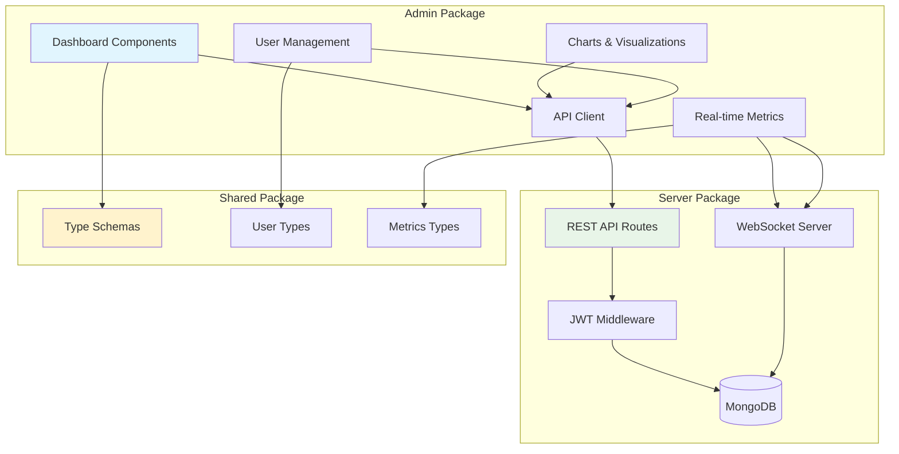

# @gameboilerplate/admin

> **React + Material-UI admin dashboard** - Real-time monitoring and management interface for the GameBoilerplate multiplayer game server with comprehensive analytics.

## 🎯 What This Package Does

The admin package provides comprehensive server management:

- **📊 Real-time Analytics** - Live server metrics, player statistics, and performance monitoring
- **👥 User Management** - View, edit, and moderate user accounts and game data  
- **🎮 Game Administration** - Monitor active games, player actions, and server health
- **🛡️ Security Monitoring** - Anti-cheat alerts, suspicious activity tracking
- **📈 Data Visualization** - Charts and graphs for usage patterns and trends

## 🏗️ Architecture Integration



---

> Comprehensive React admin dashboard for GameBoilerplate with advanced analytics and testing infrastructure.

## 🚀 Features

### Dashboard Components
- **Real-time Analytics Dashboard** - Live metrics and KPIs
- **User Management** - Guest vs Registered user analytics 
- **Interactive Charts** - Chart.js visualizations for user data
- **Game State Analytics** - Player behavior and engagement metrics
- **Server Logs** - Real-time log monitoring and filtering
- **Performance Metrics** - Server load and response time monitoring

### Advanced Analytics
- **User Type Segmentation** - Detailed guest vs registered user comparison
- **Engagement Tracking** - Session length, playtime, and activity metrics
- **Top Player Rankings** - Leaderboards by playtime and actions
- **Real-time Statistics** - Live user counts and online status
- **Activity Heatmaps** - Time-based user activity patterns
- **Conversion Funnels** - Guest to registered user conversion tracking

## 🛠 Tech Stack

- **Frontend**: React 18, Vite, TypeScript
- **State Management**: Zustand (lightweight state management)
- **UI Framework**: Material-UI (MUI) v5 with emotion styling
- **Charts**: Chart.js with react-chartjs-2 and MUI X-Charts
- **Routing**: React Router v6
- **Authentication**: JWT token-based auth with role-based access
- **Testing**: Jest with comprehensive mock server integration
- **Build Tools**: Vite for fast development and building

## 📊 Dashboard Sections

### Main Dashboard
- User metrics overview (total, active, new registrations)
- Quick stats cards with guest vs registered breakdowns
- Real-time connection status and server health
- Recent activity feed and notifications

### Charts & Analytics
- User type distribution (pie charts)
- Daily/weekly activity trends (line charts) 
- Game action breakdowns (bar charts)
- Session length distributions
- Engagement metrics visualization

### User Management
- Complete user listing with search and filtering
- Role-based user categorization (Guest, Registered, Admin)
- User activity timelines and session history
- Top players leaderboard by playtime
- Online/offline status tracking

### Server Monitoring
- Real-time server logs with severity filtering
- Performance metrics (CPU, memory, response times)
- Error tracking and alerting
- Database connection status

## 🧪 Testing Infrastructure

### Comprehensive Test Suite
- **Mock Server**: Full Express.js server with realistic API responses
- **Jest Integration**: 12+ test suites covering all dashboard features
- **Authentication Testing**: Token-based auth flow validation
- **API Integration Tests**: All admin endpoints with proper authorization
- **Chart Data Validation**: Ensures chart compatibility and data integrity
- **Performance Testing**: Response time and scalability checks

### Test Categories
- ✅ Admin Dashboard Components (9 tests)
- ✅ Authentication & Authorization (4 tests) 
- ✅ Chart Data Endpoints (3 tests)
- ✅ User Management Analytics (5+ tests)
- ✅ Performance Metrics (2 tests)
- ✅ Data Validation & Consistency (3 tests)

### Running Tests
```sh
# Run all tests
npm test

# Run specific test categories
npm run test:admin           # All admin dashboard tests
npm run test:charts          # Chart analytics tests
npm run test:integration     # Server integration tests
npm run test:unit           # Unit tests only
npm run test:coverage       # With coverage report
```

## 🚀 Development

### Setup
```sh
npm install
npm run dev
```

The dashboard will be available at [http://localhost:5173](http://localhost:5173).

### Development with Mock Server
```sh
# Terminal 1: Start mock server for testing
cd tests
node mock-server.js

# Terminal 2: Start admin dashboard
npm run dev
```

### Authentication
Default admin credentials:
- Username: `admin`
- Password: `admin123`

## 🏗 Build & Deploy

```sh
# Production build
npm run build

# Preview production build
npm run preview
```

Output is generated in the `dist/` folder with optimized React bundles.

## 🔧 API Integration

### Backend Requirements
The admin dashboard expects these API endpoints:

#### Authentication
- `POST /api/auth/login` - Admin authentication
- `GET /api/health` - Server health check

#### Admin Endpoints (require Bearer token)
- `GET /api/admin/users/metrics` - User analytics data
- `GET /api/admin/users` - User listing with pagination
- `GET /api/admin/charts/user-types` - Chart data for user distribution
- `GET /api/admin/charts/activity` - Daily activity trends
- `GET /api/admin/charts/game-actions` - Game action breakdowns
- `GET /api/admin/performance` - Server performance metrics

### Data Formats
All API responses follow consistent JSON structure with:
- User type categorization (guest vs registered)
- Chart.js compatible data formats
- Pagination support for large datasets
- Real-time metrics with timestamps

## 📈 Analytics Features

### User Segmentation
- **Guest Users**: Anonymous players with limited tracking
- **Registered Users**: Full profiles with complete analytics
- **Admin Users**: Administrative access with enhanced permissions

### Key Metrics Tracked
- Total user counts by type
- Session duration and frequency
- Game actions per user
- Conversion rates (guest → registered)
- Retention and engagement patterns
- Peak usage times and trends

### Real-time Updates
- Live user count updates
- Online/offline status tracking
- Real-time chart data refresh
- Server performance monitoring
- Activity feed with live events

## 🔐 Security & Authorization

- JWT token-based authentication
- Role-based access control (Admin, User, Guest)
- Protected admin routes with middleware
- Secure API token transmission
- Session management and timeout handling

## 🚀 Performance

- Vite for lightning-fast development builds
- Code splitting for optimized bundle sizes
- Lazy loading of dashboard components
- Efficient state management with Zustand
- Memoized chart components for smooth animations
- Responsive design for mobile and desktop

## 📝 Recent Enhancements

### Phase 4 Additions
- ✅ Complete mock server testing infrastructure
- ✅ Guest vs registered user analytics
- ✅ Advanced chart visualizations
- ✅ Real-time dashboard updates
- ✅ Comprehensive Jest test coverage
- ✅ Performance monitoring tools
- ✅ Enhanced user management features
