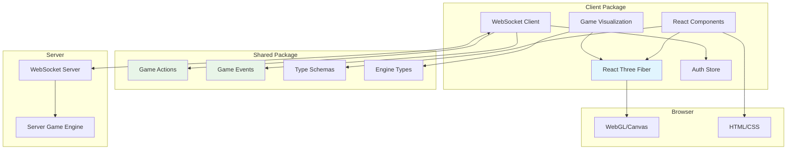

# @gameboilerplate/client

> **React + Three.js 3D game client with real-time multiplayer** - The immersive frontend that connects players to the shared game engine through beautiful 3D visualization.

## 🎯 What This Package Does

The client package provides the interactive game experience:

- **🎮 3D Game Interface** - React Three Fiber for immersive 3D gameplay
- **🌐 Real-time Multiplayer** - WebSocket integration with the game server
- **🎨 Modern UI/UX** - React components with responsive design
- **🛡️ Type-safe Actions** - Uses shared schemas for guaranteed action compatibility
- **📱 Performance Optimized** - R3F performance monitoring and optimization tools

## 🏗️ Architecture Integration



## 🚀 Quick Start

### Development Setup
```bash
cd packages/client
npm install
npm run dev
```

The client will start on [http://localhost:5173](http://localhost:5173) and connect to the server at `localhost:3000`.

### Project Structure
```
src/
├── components/          # React components
│   ├── AuthComponent/   # Authentication UI
│   ├── GameVisualization/ # 3D game rendering
│   └── UI/             # Game interface elements
├── stores/             # State management (Zustand)
│   ├── authStore.ts    # Authentication state
│   └── gameStore.ts    # Game state
├── types/              # Client-specific types
├── hooks/              # Custom React hooks
└── utils/              # Helper utilities
```

## 🎮 Game State Integration

### WebSocket Connection with Authentication

```typescript
// src/App.tsx
import React, { useEffect, useState } from 'react';
import { io, Socket } from 'socket.io-client';
import { GameAction, GameEvent } from '@gameboilerplate/shared';
import { useAuthStore } from './stores/authStore';

export default function App() {
  const { token, isAuthenticated, user } = useAuthStore();
  const [socket, setSocket] = useState<Socket | null>(null);
  const [gameState, setGameState] = useState<any>(null);

  // Connect to WebSocket when authenticated
  useEffect(() => {
    if (isAuthenticated && token) {
      const newSocket = io('http://localhost:3000', {
        auth: { token },
      });

      newSocket.on('connect', () => {
        console.log('Connected to game server');
      });

      // Handle game state updates
      newSocket.on('gameUpdate', (data) => {
        if (data.gameState) {
          setGameState(data.gameState);
        }
      });

      // Handle game events for animations/effects
      newSocket.on('gameEvent', (event: GameEvent) => {
        handleGameEvent(event);
      });

      // Handle action errors
      newSocket.on('actionError', (error) => {
        console.error('Action failed:', error);
        showErrorMessage(error.error);
      });

      setSocket(newSocket);

      return () => newSocket.disconnect();
    }
  }, [isAuthenticated, token]);

  const handleGameEvent = (event: GameEvent) => {
    switch (event.type) {
      case 'player:moved':
        animatePlayerMovement(event.data);
        break;
      case 'combat:attack':
        showCombatEffect(event.data);
        break;
      case 'item:crafted':
        showCraftingSuccess(event.data);
        break;
    }
  };

  return (
    <div className="game-container">
      {!isAuthenticated ? (
        <AuthComponent />
      ) : (
        <GameInterface socket={socket} gameState={gameState} />
      )}
    </div>
  );
}
```

### Type-Safe Action Sending

```typescript
// src/hooks/useGameActions.ts
import { useCallback } from 'react';
import { Socket } from 'socket.io-client';
import { GameAction } from '@gameboilerplate/shared';

export const useGameActions = (socket: Socket | null) => {
  const sendAction = useCallback((action: GameAction) => {
    if (!socket) {
      console.warn('Cannot send action: not connected to server');
      return;
    }

    socket.emit('gameAction', action);
  }, [socket]);

  // Specific action helpers with type safety
  const movePlayer = useCallback((direction: 'north' | 'south' | 'east' | 'west', distance: number) => {
    sendAction({
      type: 'movePlayer',
      direction,
      distance: Math.min(distance, 10) // Client-side validation
    });
  }, [sendAction]);

  const attackTarget = useCallback((targetId: string, attackType: 'melee' | 'ranged' | 'magic') => {
    sendAction({
      type: 'attack',
      targetId,
      attackType
    });
  }, [sendAction]);

  const craftItem = useCallback((recipe: string, materials: any[]) => {
    sendAction({
      type: 'craftItem',
      recipe,
      materials
    });
  }, [sendAction]);

  return {
    sendAction,
    movePlayer,
    attackTarget,
    craftItem
  };
};
```

## 🎨 3D Visualization with React Three Fiber

### Game Scene Component

```tsx
// src/components/GameVisualization/GameScene.tsx
import React, { useRef, useEffect } from 'react';
import { Canvas, useFrame } from '@react-three/fiber';
import { OrbitControls, Grid, Stats } from '@react-three/drei';
import { Perf } from 'r3f-perf';
import { GameEntity } from '@gameboilerplate/shared';

interface GameSceneProps {
  entities: Map<string, GameEntity>;
  playerEntity?: GameEntity;
}

export function GameScene({ entities, playerEntity }: GameSceneProps) {
  return (
    <Canvas
      camera={{ position: [10, 10, 10], fov: 60 }}
      shadows
      style={{ width: '100%', height: '100vh' }}
    >
      {/* Lighting */}
      <ambientLight intensity={0.4} />
      <directionalLight
        position={[10, 10, 5]}
        intensity={1}
        castShadow
        shadow-mapSize={[2048, 2048]}
      />

      {/* Environment */}
      <Grid 
        args={[100, 100]} 
        position={[0, -0.01, 0]} 
        color="#444"
        fadeDistance={50}
      />

      {/* Render all game entities */}
      {Array.from(entities.values()).map(entity => (
        <EntityRenderer 
          key={entity.id} 
          entity={entity}
          isPlayer={entity.id === playerEntity?.id}
        />
      ))}

      {/* Camera controls */}
      <CameraController playerEntity={playerEntity} />
      
      {/* Development tools */}
      <OrbitControls enablePan enableZoom enableRotate />
      <Stats />
      <Perf position="top-left" />
    </Canvas>
  );
}

// Individual entity renderer
function EntityRenderer({ entity, isPlayer }: { entity: GameEntity; isPlayer: boolean }) {
  const meshRef = useRef<THREE.Mesh>(null!);

  // Animate entity position changes
  useFrame(() => {
    if (meshRef.current) {
      // Smooth interpolation to new position
      meshRef.current.position.lerp(
        new THREE.Vector3(entity.position.x, entity.position.y, entity.position.z),
        0.1
      );
    }
  });

  return (
    <mesh
      ref={meshRef}
      position={[entity.position.x, entity.position.y, entity.position.z]}
      castShadow
      receiveShadow
    >
      <boxGeometry args={[1, 1, 1]} />
      <meshStandardMaterial 
        color={isPlayer ? '#4CAF50' : entity.type === 'enemy' ? '#F44336' : '#2196F3'}
        roughness={0.7}
        metalness={0.1}
      />
      
      {/* Health bar for living entities */}
      {entity.properties.health && (
        <HealthBar 
          health={entity.properties.health.current}
          maxHealth={entity.properties.health.max}
          position={[0, 1.5, 0]}
        />
      )}
    </mesh>
  );
}

// Dynamic camera that follows player
function CameraController({ playerEntity }: { playerEntity?: GameEntity }) {
  const { camera } = useThree();

  useFrame(() => {
    if (playerEntity) {
      const targetPosition = new THREE.Vector3(
        playerEntity.position.x + 10,
        playerEntity.position.y + 10,
        playerEntity.position.z + 10
      );
      
      camera.position.lerp(targetPosition, 0.05);
      camera.lookAt(
        playerEntity.position.x,
        playerEntity.position.y,
        playerEntity.position.z
      );
    }
  });

  return null;
}
```

## 🔐 Authentication Integration

### Auth Store (Zustand)

```typescript
// src/stores/authStore.ts
import { create } from 'zustand';
import { persist } from 'zustand/middleware';
import { User, AuthRequest } from '@gameboilerplate/shared';

interface AuthState {
  token: string | null;
  user: User | null;
  isAuthenticated: boolean;
  login: (credentials: AuthRequest) => Promise<void>;
  loginAsGuest: () => Promise<void>;
  logout: () => void;
}

export const useAuthStore = create<AuthState>()(
  persist(
    (set, get) => ({
      token: null,
      user: null,
      isAuthenticated: false,

      login: async (credentials: AuthRequest) => {
        try {
          const response = await fetch('http://localhost:3000/auth/login', {
            method: 'POST',
            headers: { 'Content-Type': 'application/json' },
            body: JSON.stringify(credentials)
          });

          if (!response.ok) {
            throw new Error('Login failed');
          }

          const data = await response.json();
          
          set({
            token: data.token,
            user: data.user,
            isAuthenticated: true
          });
        } catch (error) {
          console.error('Login error:', error);
          throw error;
        }
      },

      loginAsGuest: async () => {
        try {
          const response = await fetch('http://localhost:3000/auth/guest', {
            method: 'POST'
          });

          if (!response.ok) {
            throw new Error('Guest login failed');
          }

          const data = await response.json();
          
          set({
            token: data.token,
            user: data.user,
            isAuthenticated: true
          });
        } catch (error) {
          console.error('Guest login error:', error);
          throw error;
        }
      },

      logout: () => {
        set({
          token: null,
          user: null,
          isAuthenticated: false
        });
      }
    }),
    {
      name: 'auth-storage',
      partialize: (state) => ({ 
        token: state.token, 
        user: state.user, 
        isAuthenticated: state.isAuthenticated 
      })
    }
  )
);
```

## 🧪 Testing

### Component Testing
```bash
npm test              # Run all tests
npm run test:watch    # Watch mode
npm run test:coverage # Coverage report
```

### Example Tests
```typescript
// src/components/__tests__/GameScene.test.tsx
import { render, screen } from '@testing-library/react';
import { GameScene } from '../GameVisualization/GameScene';
import { GameEntity } from '@gameboilerplate/shared';

describe('GameScene', () => {
  const mockEntities = new Map<string, GameEntity>([
    ['player1', {
      id: 'player1',
      type: 'player',
      position: { x: 0, y: 0, z: 0 },
      rotation: { x: 0, y: 0, z: 0 },
      scale: { x: 1, y: 1, z: 1 },
      properties: { health: { current: 100, max: 100 } }
    }]
  ]);

  test('renders without crashing', () => {
    render(<GameScene entities={mockEntities} />);
    // Test that Canvas is rendered
    expect(document.querySelector('canvas')).toBeInTheDocument();
  });

  test('renders all entities', () => {
    const { container } = render(<GameScene entities={mockEntities} />);
    // Check that entity renderers are created
    // Note: Three.js testing requires special setup for full 3D testing
  });
});
```

## 🚀 Build & Deployment

### Production Build
```bash
npm run build     # Create optimized production build
npm run preview   # Preview production build locally
```

### Performance Optimization
- **Code splitting** with dynamic imports
- **Asset optimization** with Vite
- **WebGL optimizations** with R3F
- **Bundle analysis** with `npm run analyze`

## 🔗 Integration with Other Packages

- **[Shared Package](../shared/README.md)** - Uses game engine types and action schemas for type safety
- **[Server Package](../server/README.md)** - Connects via WebSocket for real-time game actions
- **[Admin Package](../admin/README.md)** - Shares authentication patterns and UI components
- **[Tests Package](../../tests/README.md)** - E2E testing of client functionality

## 🤝 Contributing

1. **Add new 3D components** in `src/components/GameVisualization/`
2. **Add new UI components** in `src/components/UI/`
3. **Extend game actions** using shared action schemas
4. **Add new stores** for additional state management
5. **Update tests** for new functionality

See the [main README](../../README.md) for general contribution guidelines.

---

*The client package provides the immersive interface for players to interact with the shared game engine. All game logic is validated server-side for security and consistency.*
