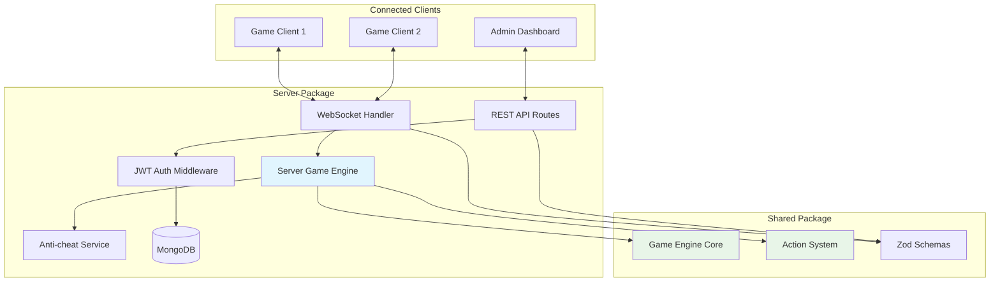

# @gameboilerplate/server

> **Express + TypeScript backend with real-time multiplayer support** - The game server that orchestrates all multiplayer interactions using the shared game engine.

## 🎯 What This Package Does

The server package is the authoritative game server that:

- **🎮 Runs the Master Game Engine** - Uses shared game engine for authoritative game state
- **🌐 Handles Real-time Communication** - WebSocket connections for multiplayer actions
- **🛡️ Validates & Secures** - JWT authentication, action validation, and anti-cheat
- **💾 Persists Game Data** - MongoDB integration for user accounts and game state
- **📊 Provides Admin APIs** - REST endpoints for administration and analytics

## 🏗️ Architecture Integration



## 🚀 Quick Start

### Development Setup
```bash
cd packages/server
npm install
npm run dev
```

The server will start on [http://localhost:3000](http://localhost:3000) by default.

### Environment Configuration
Create a `.env` file in the server package:
```env
# Server Configuration
PORT=3000
NODE_ENV=development

# Database
MONGODB_URI=mongodb://localhost:27017/gameboilerplate
DB_NAME=gameboilerplate

# Authentication
JWT_SECRET=your-secret-key-here
JWT_EXPIRES_IN=24h

# Game Engine
GAME_TICK_RATE=20
MAX_PLAYERS_PER_ROOM=50
ENABLE_ANTI_CHEAT=true
```

## 🎮 Game Engine Integration

### Server Game Engine

The server uses a specialized version of the shared game engine:

```typescript
// src/engine/ServerGameEngine.ts
import { GameEngine, ActionSystem } from '@gameboilerplate/shared';

export class ServerGameEngine {
  private engine: GameEngine;
  private networkSystem: ServerNetworkSystem;

  constructor() {
    this.engine = new GameEngine({
      tickRate: 20,        // Lower tick rate for server efficiency
      enableDebug: false,  // Disable debug in production
      autoStart: false     // Manual control for server lifecycle
    });
  }

  async initialize(): Promise<void> {
    // Add server-specific systems
    this.engine.addSystem(new AntiCheatSystem());
    this.engine.addSystem(new PersistenceSystem());
    this.engine.addSystem(this.networkSystem);
    
    // Register standard game actions
    this.registerGameActions();
    
    await this.engine.init();
  }

  private registerGameActions(): void {
    // Player movement with validation
    this.engine.registerAction({
      type: 'movePlayer',
      schema: MovePlayerSchema,
      cooldown: 100, // Prevent spam
      handler: this.handlePlayerMove.bind(this)
    });

    // Combat actions
    this.engine.registerAction({
      type: 'attack',
      schema: AttackSchema,
      cooldown: 2000,
      handler: this.handleAttack.bind(this)
    });
  }
}
```

### Real-time Action Processing

```typescript
// src/index.ts - WebSocket handler
import { GameActionSchema, JWTPayload } from '@gameboilerplate/shared';

io.on('connection', (socket) => {
  // Authenticate connection
  const token = socket.handshake.auth.token;
  const user = AuthUtils.verifyToken(token) as JWTPayload;
  
  if (!user) {
    socket.disconnect();
    return;
  }

  socket.userId = user.userId;
  socket.userRole = user.role;

  // Handle game actions
  socket.on('gameAction', async (data) => {
    try {
      // Validate action format
      const actionResult = GameActionSchema.safeParse(data);
      if (!actionResult.success) {
        socket.emit('actionError', { 
          error: 'Invalid action format',
          details: actionResult.error.issues 
        });
        return;
      }

      // Check anti-cheat
      if (!AntiCheatService.validateAction(socket.userId, actionResult.data)) {
        socket.emit('actionError', { 
          error: 'Action failed validation',
          reason: 'Possible cheating detected'
        });
        AntiCheatService.logSuspiciousActivity(socket.userId, actionResult.data);
        return;
      }

      // Execute through game engine
      const result = await serverGameEngine.executeAction(
        actionResult.data.type,
        actionResult.data,
        { 
          userId: socket.userId, 
          userRole: socket.userRole,
          engine: serverGameEngine.getEngine(),
          socket 
        }
      );

      // Send result back to client
      socket.emit('actionResult', result);

      // Broadcast events to relevant clients
      if (result.events) {
        result.events.forEach(event => {
          if (event.broadcast === 'all') {
            io.emit('gameEvent', event);
          } else if (event.broadcast === 'room') {
            io.to(socket.room).emit('gameEvent', event);
          }
        });
      }

    } catch (error) {
      console.error('Action processing error:', error);
      socket.emit('actionError', { 
        error: 'Internal server error' 
      });
    }
  });
});
```

## 🛡️ Security & Anti-Cheat

### JWT Authentication

```typescript
// src/middleware/auth.ts
import jwt from 'jsonwebtoken';
import { JWTPayload } from '@gameboilerplate/shared';

export const authenticateToken = (req: Request, res: Response, next: NextFunction) => {
  const authHeader = req.headers['authorization'];
  const token = authHeader && authHeader.split(' ')[1];

  if (!token) {
    return res.status(401).json({ error: 'Access token required' });
  }

  try {
    const decoded = jwt.verify(token, process.env.JWT_SECRET!) as JWTPayload;
    req.user = decoded;
    next();
  } catch (error) {
    return res.status(403).json({ error: 'Invalid or expired token' });
  }
};
```

### Anti-Cheat System

```typescript
// src/services/AntiCheatService.ts
export class AntiCheatService {
  private static actionHistory = new Map<string, ActionLog[]>();
  private static suspiciousActivity = new Map<string, number>();

  static validateAction(userId: string, action: GameAction): boolean {
    // Check action frequency
    if (this.isActionSpamming(userId, action.type)) {
      return false;
    }

    // Check for impossible actions
    if (this.isImpossibleAction(userId, action)) {
      return false;
    }

    // Check for guest user restrictions
    if (this.violatesGuestRestrictions(userId, action)) {
      return false;
    }

    // Log action for future validation
    this.logAction(userId, action);
    return true;
  }

  private static isActionSpamming(userId: string, actionType: string): boolean {
    const history = this.actionHistory.get(userId) || [];
    const recentActions = history.filter(
      log => log.type === actionType && 
      Date.now() - log.timestamp < 1000 // Last second
    );

    return recentActions.length > 10; // Max 10 actions per second
  }

  private static isImpossibleAction(userId: string, action: GameAction): boolean {
    // Example: Check for teleportation
    if (action.type === 'movePlayer' && action.distance > 100) {
      return true; // Impossible movement distance
    }

    // Example: Check for item spawn by non-admin
    if (action.type === 'spawnItem' && !this.isAdmin(userId)) {
      return true; // Only admins can spawn items
    }

    return false;
  }
}
```

## 💾 Database Integration

### User Model

```typescript
// src/models/User.ts
import mongoose from 'mongoose';
import { UserRole } from '@gameboilerplate/shared';

export interface IUser extends mongoose.Document {
  username?: string;
  email?: string;
  passwordHash?: string;
  role: UserRole;
  isGuest: boolean;
  gameData: {
    level: number;
    experience: number;
    inventory: any[];
    position: { x: number; y: number; z: number };
  };
  createdAt: Date;
  lastLogin?: Date;
}

const UserSchema = new mongoose.Schema({
  username: { type: String, unique: true, sparse: true },
  email: { type: String, unique: true, sparse: true },
  passwordHash: String,
  role: { 
    type: String, 
    enum: ['guest', 'registered', 'admin'],
    default: 'guest' 
  },
  isGuest: { type: Boolean, default: true },
  gameData: {
    level: { type: Number, default: 1 },
    experience: { type: Number, default: 0 },
    inventory: { type: Array, default: [] },
    position: {
      x: { type: Number, default: 0 },
      y: { type: Number, default: 0 },
      z: { type: Number, default: 0 }
    }
  },
  createdAt: { type: Date, default: Date.now },
  lastLogin: Date
});

export const UserModel = mongoose.model<IUser>('User', UserSchema);
```

### Game State Persistence

```typescript
// Game state persistence system
class PersistenceSystem implements System {
  name = 'PersistenceSystem';
  priority = 100; // Run last
  enabled = true;

  async update(deltaTime: number, gameState: GameState): Promise<void> {
    // Save player data every 30 seconds
    if (gameState.totalTime % 30000 < deltaTime) {
      await this.savePlayerData(gameState);
    }
  }

  private async savePlayerData(gameState: GameState): Promise<void> {
    for (const [id, entity] of gameState.entities) {
      if (entity.type === 'player') {
        await UserModel.findByIdAndUpdate(id, {
          'gameData.level': entity.properties.level,
          'gameData.experience': entity.properties.experience,
          'gameData.inventory': entity.properties.inventory,
          'gameData.position': entity.position,
          lastLogin: new Date()
        });
      }
    }
  }
}
```

## 🔌 REST API Routes

### Authentication Routes

```typescript
// src/routes/auth.ts
import express from 'express';
import { AuthService } from '../services/AuthService';
import { AuthRequestSchema } from '@gameboilerplate/shared';

const router = express.Router();

// Guest login
router.post('/guest', async (req, res) => {
  try {
    const guestUser = await AuthService.createGuestUser();
    const token = AuthService.generateToken(guestUser);
    
    res.json({
      token,
      user: {
        id: guestUser.id,
        role: guestUser.role,
        isGuest: true
      }
    });
  } catch (error) {
    res.status(500).json({ error: 'Failed to create guest user' });
  }
});

// User registration
router.post('/register', async (req, res) => {
  try {
    const validationResult = AuthRequestSchema.safeParse(req.body);
    if (!validationResult.success) {
      return res.status(400).json({ 
        error: 'Invalid request data',
        details: validationResult.error.issues 
      });
    }

    const user = await AuthService.registerUser(validationResult.data);
    const token = AuthService.generateToken(user);
    
    res.json({
      token,
      user: {
        id: user.id,
        username: user.username,
        email: user.email,
        role: user.role,
        isGuest: false
      }
    });
  } catch (error) {
    res.status(400).json({ error: error.message });
  }
});

export default router;
```

### Admin Routes

```typescript
// src/routes/admin.ts
import express from 'express';
import { authenticateToken, requireAdmin } from '../middleware/auth';

const router = express.Router();

// Get server statistics
router.get('/stats', authenticateToken, requireAdmin, async (req, res) => {
  try {
    const stats = {
      players: {
        online: io.sockets.sockets.size,
        total: await UserModel.countDocuments(),
        guests: await UserModel.countDocuments({ isGuest: true })
      },
      gameEngine: serverGameEngine.getStats(),
      server: {
        uptime: process.uptime(),
        memory: process.memoryUsage(),
        version: process.env.npm_package_version
      }
    };
    
    res.json(stats);
  } catch (error) {
    res.status(500).json({ error: 'Failed to fetch statistics' });
  }
});

// Get all users with pagination
router.get('/users', authenticateToken, requireAdmin, async (req, res) => {
  try {
    const page = parseInt(req.query.page as string) || 1;
    const limit = parseInt(req.query.limit as string) || 50;
    const skip = (page - 1) * limit;

    const users = await UserModel
      .find()
      .select('-passwordHash')
      .skip(skip)
      .limit(limit)
      .sort({ createdAt: -1 });

    const total = await UserModel.countDocuments();

    res.json({
      users,
      pagination: {
        page,
        limit,
        total,
        pages: Math.ceil(total / limit)
      }
    });
  } catch (error) {
    res.status(500).json({ error: 'Failed to fetch users' });
  }
});

export default router;
```

## 📊 Metrics & Monitoring

```typescript
// src/services/MetricsService.ts
export class MetricsTracker {
  private static metrics = {
    actions: new Map<string, number>(),
    errors: new Map<string, number>(),
    connections: 0,
    gameEvents: 0
  };

  static trackAction(actionType: string): void {
    const current = this.metrics.actions.get(actionType) || 0;
    this.metrics.actions.set(actionType, current + 1);
  }

  static trackError(errorType: string): void {
    const current = this.metrics.errors.get(errorType) || 0;
    this.metrics.errors.set(errorType, current + 1);
  }

  static getMetrics() {
    return {
      actions: Object.fromEntries(this.metrics.actions),
      errors: Object.fromEntries(this.metrics.errors),
      connections: this.metrics.connections,
      gameEvents: this.metrics.gameEvents,
      uptime: process.uptime()
    };
  }
}
```

## 🧪 Testing

### API Testing
```bash
npm test                 # Run all server tests
npm run test:integration # Integration tests
npm run test:api        # API endpoint tests
```

### Example Tests
```typescript
// tests/auth.test.ts
import request from 'supertest';
import { app } from '../src/index';

describe('Auth Routes', () => {
  test('should create guest user', async () => {
    const response = await request(app)
      .post('/auth/guest')
      .expect(200);

    expect(response.body).toHaveProperty('token');
    expect(response.body.user.isGuest).toBe(true);
    expect(response.body.user.role).toBe('guest');
  });

  test('should register new user', async () => {
    const userData = {
      username: 'testuser',
      email: 'test@example.com',
      password: 'password123'
    };

    const response = await request(app)
      .post('/auth/register')
      .send(userData)
      .expect(200);

    expect(response.body).toHaveProperty('token');
    expect(response.body.user.username).toBe('testuser');
    expect(response.body.user.isGuest).toBe(false);
  });
});
```

## 🚀 Deployment

### Production Build
```bash
npm run build    # Compile TypeScript
npm start        # Start production server
```

### Docker Support
```dockerfile
# Dockerfile
FROM node:22-alpine

WORKDIR /app
COPY package*.json ./
RUN npm ci --only=production

COPY dist/ ./dist/
COPY .env.production ./.env

EXPOSE 3000
CMD ["npm", "start"]
```

## 🔗 Integration with Other Packages

- **[Shared Package](../shared/README.md)** - Uses game engine and types for authoritative game logic
- **[Client Package](../client/README.md)** - Provides WebSocket API for real-time game actions
- **[Admin Package](../admin/README.md)** - Serves REST API for dashboard and user management
- **[Tests Package](../../tests/README.md)** - Comprehensive server testing including API and WebSocket tests

## 🤝 Contributing

1. **Add new game actions** by extending the shared action schemas
2. **Add new API routes** in `src/routes/`
3. **Add new systems** that integrate with the shared game engine
4. **Add middleware** for cross-cutting concerns
5. **Update tests** for any new functionality

See the [main README](../../README.md) for general contribution guidelines.

---

*The server package is the authoritative source of truth for all game state and multiplayer interactions. All changes here should maintain consistency with the shared game engine architecture.*
