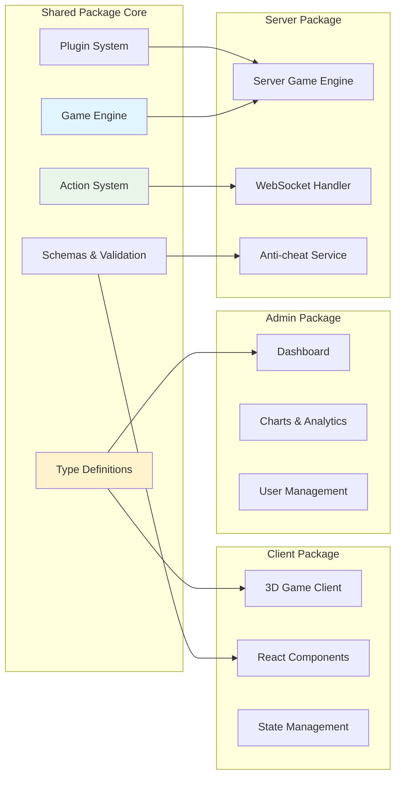

# @gameboilerplate/shared

> **The heart of the GameBoilerplate architecture** - A comprehensive TypeScript-first game engine featuring Entity-Component-System (ECS) architecture, real-time action processing, and extensible plugin system.

## 🌟 What's Inside

The shared package is the foundation that powers all other packages in the monorepo:

- **🎮 Complete Game Engine** - ECS-based architecture with systems, entities, and components
- **⚡ Action System** - Type-safe game actions with validation, cooldowns, and anti-cheat
- **🔌 Plugin Architecture** - Extensible system for custom game mechanics
- **🌐 Network Integration** - Real-time multiplayer support with WebSocket events
- **🎨 React Three Fiber** - Automatic 3D visualization of game entities
- **🛡️ Type Safety** - End-to-end TypeScript with Zod runtime validation

## 🏗️ How It Powers Other Packages



## 🚀 Quick Start

### Basic Game Engine Setup

```typescript
import { GameEngine, ActionSystem } from '@gameboilerplate/shared';

// Create and initialize engine
const engine = new GameEngine({
  tickRate: 60,
  enableDebug: true
});

await engine.init();

// Create a player entity
const player = engine.createEntity('player', { x: 0, y: 0, z: 0 });
player.properties = {
  health: 100,
  level: 1,
  inventory: []
};

engine.addEntity(player);
engine.start();
```

### Real-World Usage Examples

#### Server Integration
```typescript
// packages/server/src/index.ts
import { ServerGameEngine } from '@gameboilerplate/shared';

const gameEngine = new ServerGameEngine();
await gameEngine.initialize();

// Handle WebSocket actions
socket.on('gameAction', async (data) => {
  const result = await gameEngine.executeAction(
    data.type,
    data.payload,
    { userId: socket.userId, engine: gameEngine }
  );
  
  socket.emit('actionResult', result);
});
```

#### Client Integration
```typescript
// packages/client/src/App.tsx
import { GameAction, GameEvent } from '@gameboilerplate/shared';

const sendPlayerAction = (action: GameAction) => {
  socket.emit('gameAction', action);
};

// Type-safe action creation
const movePlayer = () => {
  sendPlayerAction({
    type: 'movePlayer',
    direction: 'north',
    distance: 5
  });
};
```

## 🎮 Core Components

### Game Engine

The central coordinator for all game systems and entities:

```typescript
import { GameEngine, IGameEngine } from '@gameboilerplate/shared';

const engine: IGameEngine = new GameEngine({
  tickRate: 60,           // Updates per second
  maxEntities: 1000,      // Entity limit
  enableDebug: false,     // Debug logging
  enableProfiling: true   // Performance monitoring
});

// Entity management
const entity = engine.createEntity('player', { x: 10, y: 0, z: 5 });
engine.addEntity(entity);

// System management  
engine.addSystem(new CustomSystem());

// Get runtime statistics
const stats = engine.getStats();
console.log(`FPS: ${stats.fps}, Entities: ${stats.entityCount}`);
```

### Action System

Type-safe game actions with automatic validation and cooldown management:

```typescript
import { z } from 'zod';

// Define action schema
const MovePlayerSchema = z.object({
  direction: z.enum(['north', 'south', 'east', 'west']),
  distance: z.number().min(1).max(10)
});

// Register action
engine.registerAction({
  type: 'movePlayer',
  schema: MovePlayerSchema,
  cooldown: 1000, // 1 second cooldown
  handler: async (data, context) => {
    const player = context.engine.getEntity(context.userId);
    
    if (!player) {
      return { success: false, message: 'Player not found' };
    }
    
    // Update position based on direction
    const { direction, distance } = data;
    switch (direction) {
      case 'north': player.position.z -= distance; break;
      case 'south': player.position.z += distance; break;
      case 'east': player.position.x += distance; break;
      case 'west': player.position.x -= distance; break;
    }
    
    return {
      success: true,
      data: { newPosition: player.position },
      events: [{
        type: 'player:moved',
        data: { userId: context.userId, position: player.position },
        timestamp: Date.now()
      }]
    };
  }
});

// Execute action (automatic validation and cooldown checking)
const result = await engine.executeAction('movePlayer', {
  direction: 'north',
  distance: 3
}, { userId: 'player123', engine });
```

### Entity-Component-System (ECS)

Modular game object architecture for maximum flexibility:

```typescript
import { GameEntity, System, GameState } from '@gameboilerplate/shared';

// Create entities with components
const player: GameEntity = {
  id: 'player_001',
  type: 'player',
  position: { x: 0, y: 0, z: 0 },
  rotation: { x: 0, y: 0, z: 0 },
  scale: { x: 1, y: 1, z: 1 },
  properties: {
    // Components as properties
    health: { current: 100, max: 100 },
    inventory: { items: [], capacity: 20 },
    skills: { level: 1, experience: 0 }
  }
};

// Create systems to operate on entities
class HealthRegenSystem implements System {
  name = 'HealthRegenSystem';
  priority = 10;
  enabled = true;

  async update(deltaTime: number, gameState: GameState): Promise<void> {
    for (const entity of gameState.entities.values()) {
      if (entity.type === 'player' && entity.properties.health) {
        const health = entity.properties.health;
        if (health.current < health.max) {
          // Regenerate 1 HP per second
          health.current = Math.min(health.max, health.current + deltaTime / 1000);
        }
      }
    }
  }
}

// Add system to engine
engine.addSystem(new HealthRegenSystem());
```

### Plugin System

Extensible architecture for game features:

```typescript
import { GamePlugin, IGameEngine } from '@gameboilerplate/shared';

export class CombatPlugin implements GamePlugin {
  name = 'CombatPlugin';
  version = '1.0.0';
  dependencies = ['HealthSystem'];

  async install(engine: IGameEngine): Promise<void> {
    // Add combat system
    engine.addSystem(new CombatSystem());
    
    // Register combat actions
    engine.registerAction({
      type: 'attack',
      schema: z.object({
        targetId: z.string(),
        attackType: z.enum(['melee', 'ranged', 'magic'])
      }),
      cooldown: 2000,
      handler: this.handleAttack.bind(this)
    });
    
    console.log('⚔️ Combat plugin installed');
  }

  async uninstall(engine: IGameEngine): Promise<void> {
    engine.removeSystem('CombatSystem');
    console.log('⚔️ Combat plugin uninstalled');
  }

  private async handleAttack(data: any, context: any) {
    // Combat logic implementation
    const attacker = context.engine.getEntity(context.userId);
    const target = context.engine.getEntity(data.targetId);
    
    // Calculate and apply damage
    const damage = this.calculateDamage(attacker, data.attackType);
    target.properties.health.current -= damage;
    
    return {
      success: true,
      data: { damage, targetHealth: target.properties.health.current },
      events: [{
        type: 'combat:attack',
        data: { attackerId: context.userId, targetId: data.targetId, damage },
        timestamp: Date.now()
      }]
    };
  }
}

// Install plugin
await engine.installPlugin(new CombatPlugin());
```

## 🌐 Network Integration

### Real-time Multiplayer Support

The shared package provides the foundation for real-time multiplayer games:

```typescript
// Server-side: Handle network actions
import { GameActionSchema, GameEventSchema } from '@gameboilerplate/shared';

io.on('connection', (socket) => {
  socket.on('gameAction', async (data) => {
    // Validate using shared schemas
    const actionResult = GameActionSchema.safeParse(data);
    if (!actionResult.success) {
      socket.emit('actionError', { error: 'Invalid action format' });
      return;
    }
    
    // Process through engine
    const result = await gameEngine.executeAction(
      actionResult.data.type,
      actionResult.data,
      { userId: socket.userId, engine: gameEngine }
    );
    
    // Send response
    socket.emit('actionResult', result);
    
    // Broadcast events
    if (result.events) {
      result.events.forEach(event => {
        io.emit('gameEvent', event);
      });
    }
  });
});
```

```typescript
// Client-side: Send actions and handle events
import { GameAction, GameEvent } from '@gameboilerplate/shared';

// Type-safe action sending
const castSpell = (targetId: string, spellType: string) => {
  const action: GameAction = {
    type: 'castSpell',
    targetId,
    spellType,
    manaCost: 20
  };
  
  socket.emit('gameAction', action);
};

// Handle events with proper typing
socket.on('gameEvent', (event: GameEvent) => {
  switch (event.type) {
    case 'spell:cast':
      playSpellAnimation(event.data);
      break;
    case 'player:joined':
      addPlayerToScene(event.data);
      break;
  }
});
```

## 🎨 React Three Fiber Integration

Automatic 3D visualization of game entities:

```tsx
import React from 'react';
import { Canvas } from '@react-three/fiber';
import { GameEngine, useGameEngine, GameScene } from '@gameboilerplate/shared';

function GameComponent() {
  const { engine, entities, isLoading } = useGameEngine({
    gameType: 'rpg',
    userId: 'player123',
    serverUrl: 'ws://localhost:3000'
  });

  if (isLoading) return <div>Loading game...</div>;

  return (
    <div style={{ width: '100vw', height: '100vh' }}>
      <Canvas camera={{ position: [10, 10, 10] }}>
        <ambientLight intensity={0.5} />
        <pointLight position={[10, 10, 10]} />
        
        {/* Automatically render all entities */}
        <GameScene engine={engine} />
        
        {/* Or manually render specific entities */}
        {entities.map(entity => (
          <EntityRenderer key={entity.id} entity={entity} />
        ))}
      </Canvas>
    </div>
  );
}

// Custom entity renderer
function EntityRenderer({ entity }: { entity: GameEntity }) {
  return (
    <mesh position={[entity.position.x, entity.position.y, entity.position.z]}>
      <boxGeometry args={[1, 1, 1]} />
      <meshStandardMaterial color={entity.type === 'player' ? 'blue' : 'red'} />
    </mesh>
  );
}
```

## 🎯 Game Type Presets

Pre-configured setups for different game genres:

```typescript
// RPG Game - Character progression, inventory, quest systems
const rpgEngine = new GameEngine();
await rpgEngine.init('rpg');
// Includes: CharacterSystem, InventorySystem, QuestSystem, ExperienceSystem

// RTS Game - Units, resources, building systems  
const rtsEngine = new GameEngine();
await rtsEngine.init('rts');
// Includes: UnitSystem, ResourceSystem, BuildingSystem, PathfindingSystem

// MMO Game - Large-scale multiplayer systems
const mmoEngine = new GameEngine();
await mmoEngine.init('mmo');
// Includes: GuildSystem, ChatSystem, InstanceSystem, EconomySystem

// Custom Game - Minimal setup, add your own systems
const customEngine = new GameEngine();
await customEngine.init('custom');
// Includes: Only core EntitySystem and ActionSystem
```

## 📚 API Reference

### Core Classes

#### GameEngine
```typescript
interface IGameEngine {
  // Lifecycle
  init(gameType?: string): Promise<void>;
  start(): Promise<void>;
  stop(): Promise<void>;
  
  // Entity Management
  createEntity(type: string, position?: Vector3): GameEntity;
  addEntity(entity: GameEntity): void;
  removeEntity(id: string): void;
  getEntity(id: string): GameEntity | undefined;
  getEntitiesByType(type: string): GameEntity[];
  
  // System Management
  addSystem(system: System): void;
  removeSystem(name: string): void;
  getSystem<T extends System>(name: string): T | undefined;
  
  // Action Processing
  registerAction(definition: ActionDefinition): void;
  executeAction(type: string, data: any, context: ActionContext): Promise<ActionResult>;
  
  // Events
  emit(event: string, data?: any): void;
  on(event: string, callback: (data?: any) => void): void;
  
  // Stats & Debugging
  getStats(): EngineStats;
}
```

#### ActionSystem
```typescript
interface IActionSystem {
  registerAction(definition: ActionDefinition): void;
  unregisterAction(type: string): void;
  processAction(type: string, data: any, context: ActionContext): Promise<ActionResult>;
  isOnCooldown(userId: string, actionType: string): boolean;
}
```

#### Built-in Systems

- **EntitySystem** - Core entity management
- **ActionSystem** - Action processing and validation
- **NetworkSystem** - Real-time synchronization
- **PhysicsSystem** - Basic collision detection
- **InventorySystem** - Item management
- **CharacterSystem** - Player progression
- **QuestSystem** - Mission and objective tracking

### Built-in Plugins

#### FarmingPlugin
Complete farming system with crops, growth mechanics, and harvesting:

```typescript
import { FarmingPlugin } from '@gameboilerplate/shared';

await engine.installPlugin(new FarmingPlugin());

// Plant crops
await engine.executeAction('plantSeed', {
  seedType: 'wheat',
  position: { x: 5, y: 0, z: 5 }
}, context);

// Harvest mature crops
await engine.executeAction('harvestCrop', {
  position: { x: 5, y: 0, z: 5 }
}, context);
```

## 🔧 Extending the Engine

### Creating Custom Systems

```typescript
import { System, GameState, IGameEngine } from '@gameboilerplate/shared';

class WeatherSystem implements System {
  name = 'WeatherSystem';
  priority = 15; // Lower numbers run first
  enabled = true;
  
  private weather = {
    temperature: 20,
    precipitation: 0,
    windSpeed: 5
  };

  async init(engine: IGameEngine): Promise<void> {
    console.log('🌤️ Weather system initialized');
    // Set up initial weather
  }

  async update(deltaTime: number, gameState: GameState): Promise<void> {
    // Update weather every 30 seconds
    if (gameState.totalTime % 30000 < deltaTime) {
      this.updateWeather();
      this.applyWeatherEffects(gameState);
    }
  }

  private updateWeather(): void {
    // Gradually change weather
    this.weather.temperature += (Math.random() - 0.5) * 2;
    this.weather.precipitation = Math.max(0, this.weather.precipitation + (Math.random() - 0.7) * 10);
  }

  private applyWeatherEffects(gameState: GameState): void {
    for (const entity of gameState.entities.values()) {
      if (entity.type === 'player') {
        // Apply temperature effects
        if (this.weather.temperature < 0) {
          entity.properties.statusEffects = entity.properties.statusEffects || [];
          entity.properties.statusEffects.push('cold');
        }
        
        // Apply rain effects
        if (this.weather.precipitation > 50) {
          entity.properties.movementSpeed *= 0.8; // Slow movement in heavy rain
        }
      }
    }
  }

  async destroy(): Promise<void> {
    console.log('🌤️ Weather system destroyed');
  }
}

// Register the system
engine.addSystem(new WeatherSystem());
```

### Creating Custom Actions

```typescript
import { z } from 'zod';

// Define schema for type safety
const TradeItemSchema = z.object({
  targetPlayerId: z.string(),
  offeredItems: z.array(z.object({
    itemId: z.string(),
    quantity: z.number().min(1)
  })),
  requestedItems: z.array(z.object({
    itemId: z.string(),
    quantity: z.number().min(1)
  }))
});

// Register the action
engine.registerAction({
  type: 'tradeItems',
  schema: TradeItemSchema,
  cooldown: 5000, // 5 second cooldown between trades
  handler: async (data, context) => {
    const trader = context.engine.getEntity(context.userId);
    const target = context.engine.getEntity(data.targetPlayerId);
    
    if (!trader || !target) {
      return { success: false, message: 'Invalid players' };
    }
    
    // Validate both players have required items
    const traderHasItems = validateInventory(trader, data.offeredItems);
    const targetHasItems = validateInventory(target, data.requestedItems);
    
    if (!traderHasItems || !targetHasItems) {
      return { success: false, message: 'Insufficient items for trade' };
    }
    
    // Execute the trade
    removeItems(trader, data.offeredItems);
    addItems(trader, data.requestedItems);
    removeItems(target, data.requestedItems);
    addItems(target, data.offeredItems);
    
    return {
      success: true,
      data: { 
        traderInventory: trader.properties.inventory,
        targetInventory: target.properties.inventory
      },
      events: [{
        type: 'trade:completed',
        data: {
          traderId: context.userId,
          targetId: data.targetPlayerId,
          offeredItems: data.offeredItems,
          requestedItems: data.requestedItems
        },
        timestamp: Date.now()
      }]
    };
  }
});
```

## 🧪 Testing

### Unit Tests
```bash
npm test                    # Run all tests
npm run test:watch         # Watch mode
npm run test:coverage      # Coverage report
```

### Test Examples
```typescript
import { GameEngine, ActionSystem } from '../src';

describe('GameEngine', () => {
  let engine: GameEngine;

  beforeEach(async () => {
    engine = new GameEngine();
    await engine.init();
  });

  afterEach(async () => {
    await engine.stop();
  });

  test('should create and manage entities', () => {
    const entity = engine.createEntity('player', { x: 0, y: 0, z: 0 });
    engine.addEntity(entity);
    
    expect(engine.getEntity(entity.id)).toBe(entity);
    expect(engine.getEntitiesByType('player')).toContain(entity);
  });

  test('should process actions with validation', async () => {
    engine.registerAction({
      type: 'testAction',
      schema: z.object({ value: z.number() }),
      handler: async (data) => ({ success: true, data })
    });

    const result = await engine.executeAction('testAction', { value: 42 }, {
      userId: 'test',
      engine
    });

    expect(result.success).toBe(true);
    expect(result.data.value).toBe(42);
  });
});
```

## 🚀 Development

### Building
```bash
npm run build       # Build the package
npm run build:watch # Watch mode for development
```

### Type Checking
```bash
npm run type-check  # TypeScript type checking
```

### Linting
```bash
npm run lint        # ESLint
npm run lint:fix    # Fix auto-fixable issues
```

## 🔗 Integration with Other Packages

The shared package is designed to integrate seamlessly with all other packages:

- **[Server Package](../server/README.md)** - Uses ServerGameEngine for multiplayer logic
- **[Client Package](../client/README.md)** - Uses GameEngine for client-side game state
- **[Admin Package](../admin/README.md)** - Uses types and schemas for data consistency
- **[Tests Package](../../tests/README.md)** - Tests all shared functionality

## 🤝 Contributing

1. **Add new systems** in `src/engine/systems/`
2. **Add new plugins** in `src/engine/plugins/`
3. **Update types** in `src/engine/types.ts`
4. **Add tests** for new functionality
5. **Update documentation** in this README

See the [main README](../../README.md) for general contribution guidelines.

---

*This package forms the foundation of the entire GameBoilerplate ecosystem. Changes here affect all other packages, so please test thoroughly!*
